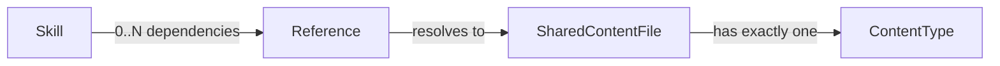

# Phase 1 Data Model: Shared Content Library

## Entities

### Shared Content File

A markdown file under `.highway/content/`, belonging to exactly one content type.

| Field | Source | Constraint |
|---|---|---|
| `path` | Filesystem location, framework-relative (relative to `.highway/`) | Under exactly one of `content/templates/`, `content/knowledge/`, `content/governance/` (FR-001) |
| `content_type` | Derived from `path`'s immediate parent under `.highway/content/` | One of `template`, `knowledge`, `governance` |
| `name` | Frontmatter `name` | Non-empty (FR-014) |
| `description` | Frontmatter `description` | Non-empty, ≤500 characters (FR-014, Decision 6) |
| `version` | Frontmatter `metadata.version` | Matches `MAJOR.MINOR.PATCH` (FR-014, FR-015) |

**Validation rules applicable by `content_type`** (FR-016, Decision 1):

| Rule ID | governance / knowledge | template |
|---|---|---|
| P1.1 | checked | **N/A (N2)** |
| P1.3 | checked | **N/A (N2)** |
| P3.5 | checked (self-gates N/A if no citation present) | checked (self-gates N/A if no citation present) |
| P4.2 | checked (self-gates N/A — no Verification section) | checked (self-gates N/A) |
| P5.2 | checked (self-gates N/A — no Error Handling section) | checked (self-gates N/A) |
| P5.3 | checked (self-gates N/A if no "retry" text) | checked (self-gates N/A) |
| P7.1 | checked (self-gates pass if no Purpose section) | checked (self-gates pass) |
| P7.2 | checked | checked |
| P7.4 | checked | **N/A (N2)** |
| P7.5 | checked | **N/A (N2)** |
| P8.1 | checked (self-gates N/A if no ordered list) | checked (self-gates N/A) |
| P8.3 | checked (self-gates pass if no Verification section) | checked (self-gates pass) |

A rule not in the registry at all (every `[agent-checkable]` or `[human-review]` tier rule) is
reported as `DEFERRED`, identical to how `validate-skill.sh` already reports them for skills.

### Content Type

An enum: `template` | `knowledge` | `governance`. Determined solely from which of the three
directories a file lives under (FR-002, FR-003, FR-004). A file directly under
`.highway/content/` (not inside one of the three subdirectories) has no valid content type and
fails validation with a `[SCHEMA]`-tagged error.

### Reference (Dependency)

A named dependency from a skill to a Shared Content File, recorded in the skill's own
`SKILL.md` frontmatter.

| Field | Source | Constraint |
|---|---|---|
| `path` | `metadata.dependencies[].path` | Framework-relative (relative to `.highway/`); a file must exist at `$HIGHWAY_ROOT/$path` (FR-006) |
| `version` | `metadata.dependencies[].version` | Matches `MAJOR.MINOR.PATCH`; must equal the referenced file's current `metadata.version` (FR-015) |

Zero dependencies (field absent) is valid. A skill may declare more than one dependency. Two
different skills may pin two different versions of the same `path` without conflicting with
each other (Edge Cases: version-conflict case resolved by per-skill pinning).

## Relationships

## State / Validation Outcomes

A dependency resolution has exactly one outcome per entry:

| Outcome | Condition |
|---|---|
| `resolved` | Path exists under `.highway/content/` and pinned `version` equals the file's current `metadata.version` |
| `missing` | No file exists at the resolved path (FR-006) |
| `version-mismatch` | File exists but its current `metadata.version` differs from the pinned `version` (FR-015) |

`missing` and `version-mismatch` are both validation failures (`[DEPENDENCY]`-tagged); only
`resolved` is a pass. There is no fourth outcome — every dependency entry falls into exactly one
of these three (Principle VI: exhaustive branches).
