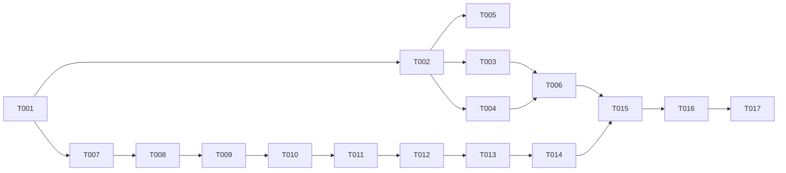

---

description: "Task list template for feature implementation"
---

# Tasks: Help Output Namespacing

**Input**: Design documents from `/specs/008-help-output-namespacing/`
**Prerequisites**: [plan.md](./plan.md), [spec.md](./spec.md), [research.md](./research.md), [data-model.md](./data-model.md), [contracts/](./contracts/), [quickstart.md](./quickstart.md)

**Tests**: Not explicitly requested in the feature specification (no TDD ask); this feature
extends the existing shell test suite (`.highway/tools/tests/*.test.sh`) in place rather than
adding a separate contract-test layer.

**Organization**: Tasks are grouped by user story to enable independent implementation and
testing of each story.

## Format: `[ID] [P?] [Story] Description`

- **[P]**: Can run in parallel (different files, no dependencies)
- **[Story]**: Which user story this task belongs to (US1, US2, US3, US4)
- Include exact file paths in descriptions

## Path Conventions

Single project, repository root. All paths below are relative to the repository root.

---

## Phase 1: Setup

**Purpose**: Confirm a clean baseline before making any change.

- [X] T001 Run `.highway/tools/tests/run-all.sh` from repo root; confirm exit 0 and record the
      passing test count as the baseline for T016's regression check. (Baseline: 13 passed, 0
      failed.)

---

## Phase 2: Foundational

**Purpose**: Blocking prerequisites for all user stories.

No foundational tasks: the generator half (US1) and the help-skill-content half (US2/US3/US4) of
this feature touch disjoint file sets with no shared blocking dependency beyond the design
decisions already recorded in [research.md](./research.md) and [data-model.md](./data-model.md).
User story work can begin immediately after T001.

---

## Phase 3: User Story 1 - Namespace separator is a hyphen, not a dot (Priority: P1) 🎯 MVP

**Goal**: Every agent adapter path uses `highway-<id>` (hyphen); the dot-separated artifacts
feature 007 shipped are removed on regeneration.

**Independent Test**: Regenerate agent adapters and confirm every path under
`.github/skills/`, `.claude/skills/`, and `.cursor/rules/` uses `highway-<id>`, with no
`highway.<id>` path remaining anywhere.

### Implementation for User Story 1

- [X] T002 [US1] In `.highway/tools/generate-agent-adapters.sh`: change `AGENT_TARGET_TEMPLATES`
      to the hyphen form (`.github/skills/highway-%s/SKILL.md`,
      `.claude/skills/highway-%s/SKILL.md`, `.cursor/rules/highway-%s.mdc`), change
      `AGENT_OLD_TARGET_TEMPLATES` to the previous dot form
      (`.github/skills/highway.%s/SKILL.md`, `.claude/skills/highway.%s/SKILL.md`,
      `.cursor/rules/highway.%s.mdc`) so the existing stale-artifact-removal mechanism now
      retires the dot paths, and update the header comment's path examples and contract
      reference to `contracts/agent-adapter-contract.md` (this feature), per
      [contracts/agent-adapter-contract.md](./contracts/agent-adapter-contract.md).
- [X] T003 [P] [US1] Update `.highway/tools/tests/generate-agent-adapters.test.sh`: change
      `GH_TARGET`/`CLAUDE_TARGET`/`CURSOR_TARGET` from `highway.$TMP_ID` to `highway-$TMP_ID`,
      and add an assertion that a pre-seeded dot-namespaced artifact
      (`highway.$TMP_ID`) is removed by the run, matching Scenario 1 in
      [quickstart.md](./quickstart.md).
- [X] T004 [P] [US1] Update `.highway/tools/tests/new-agent-extensibility.test.sh`: change every
      `highway.$TMP_ID` reference to `highway-$TMP_ID`, keeping the `AGENT_TARGET_TEMPLATES`
      sed-injection assertion in sync with the new array contents.
- [X] T005 [US1] Run `.highway/tools/generate-agent-adapters.sh` from repo root (depends on
      T002); confirm exit 0, confirm `.github/skills/highway-help/SKILL.md`,
      `.claude/skills/highway-help/SKILL.md`, and `.cursor/rules/highway-help.mdc` now exist,
      and confirm `.github/skills/highway.help/`, `.claude/skills/highway.help/`, and
      `.cursor/rules/highway.help.mdc` no longer exist. (The two dot-namespaced parent
      directories existed but were already empty pre-existing cruft with no tracked SKILL.md/
      manifest row; removed with `rmdir` since they were empty.)
- [X] T006 [US1] Run `.highway/tools/tests/generate-agent-adapters.test.sh` and
      `.highway/tools/tests/new-agent-extensibility.test.sh` directly (depends on T002, T003,
      T004); confirm both exit 0.

**Checkpoint**: Hyphen namespace live end-to-end across all three agents; zero dot artifacts
remain (SC-001).

---

## Phase 4: User Story 2 - Name matches the agent-facing skill identifier (Priority: P1)

**Goal**: Help output's `Name:` field is computed as `highway-<id>`, never copied from
frontmatter `name`.

**Independent Test**: Request single-skill help for `help` and the all-skills listing; confirm
every `Name:` line reads `highway-<id>`.

### Implementation for User Story 2

- [X] T007 [US2] Update `.highway/skills/help/SKILL.md`'s `## Inputs` section: remove `name`
      from the list of frontmatter fields read for Single-Skill mode's `Name:` field, and state
      that `Name:` is computed as `highway-<id>` from the resolved catalog `id`, per
      [contracts/help-output-contract.md](./contracts/help-output-contract.md) and
      [research.md](./research.md) R2.
- [X] T008 [US2] Update `.highway/skills/help/SKILL.md`'s `## Outputs` section: state that both
      Single-Skill and All-Skills mode `Name:` lines read `highway-<id>` (computed, not
      frontmatter-copied), and repoint the contract link to
      `../../../specs/008-help-output-namespacing/contracts/help-output-contract.md`.
- [X] T009 [US2] Bump `.highway/skills/help/SKILL.md`'s `metadata.version` from `1.0.0` to
      `2.0.0` (MAJOR breaking change per P7.7, [research.md](./research.md) R6) — this single
      bump also covers the User Story 3 and User Story 4 edits below, since all are shipped
      together against the same prior version.

**Checkpoint**: `Name:` reads `highway-help` in both modes (SC-002).

---

## Phase 5: User Story 3 - Usage and Help lines reference the namespaced command (Priority: P1)

**Goal**: `Usage:` (single-skill mode) and `Help:` (all-skills mode) instruct the `/highway-help`
invocation form.

**Independent Test**: Request single-skill help for `help`; confirm `Usage:` reads using
`/highway-help`. Request the all-skills listing; confirm every entry's `Help:` line reads
`/highway-help <id>`.

### Implementation for User Story 3

- [X] T010 [US3] Update `.highway/skills/help/SKILL.md`'s frontmatter `usage` field: change
      `` `/help` `` and `` `/help <skill-id>` `` to `` `/highway-help` `` and
      `` `/highway-help <skill-id>` ``, per [research.md](./research.md) R3.
- [X] T011 [US3] Update `.highway/skills/help/SKILL.md`'s `## Outputs` section, All-Skills mode
      description: change `Help: /help <id>` to `Help: /highway-help <id>`, per
      [research.md](./research.md) R4.

**Checkpoint**: `Usage:` and `Help:` fields both reference `/highway-help` (SC-003).

---

## Phase 6: User Story 4 - Example invocation is copy-able (Priority: P2)

**Goal**: `Example:` presents its invocation as an inline code span; the authoring standard
documents this requirement so future skills comply automatically.

**Independent Test**: Request single-skill help for `help`; confirm the `Example:` line's value
is an inline code span containing exactly `/highway-help help` and nothing else.

### Implementation for User Story 4

- [X] T012 [US4] Update `.highway/skills/help/SKILL.md`'s `## Example` section: replace the
      invocation's fenced code block with an inline code span `` `/highway-help help` ``, and
      update the sample-output fenced block's `Name:`, `Version:`, `Usage:`, and `Example:`
      lines to the corrected values (`Name: highway-help`, `Version: 2.0.0`, hyphen-form
      `Usage:`, `Example: \`/highway-help help\``), per
      [contracts/help-output-contract.md](./contracts/help-output-contract.md) and
      [research.md](./research.md) R5.
- [X] T013 [US4] Update `.highway/skills/_authoring-standard.md`'s `## Example` row: state the
      literal invocation MUST be presented as an inline code span (not solely a fenced block),
      so a newly authored skill satisfies FR-010 without a special case.
- [X] T014 [US4] Confirm `.highway/skills/help/SKILL.md`'s `metadata.version` is `2.0.0` (bumped
      in T009); if this story is being implemented standalone without T009, perform that same
      MAJOR bump here instead.

**Checkpoint**: `Example:` is independently copy-able; the authoring standard enforces this for
future skills (SC-004, SC-005).

---

## Phase 7: Polish & Cross-Cutting Concerns

**Purpose**: Final validation across every story.

- [X] T015 Run `.highway/tools/validate-skill.sh .highway/skills/help`; confirm exit 0.
- [X] T015b Run `.highway/tools/generate-agent-adapters.sh` and `.highway/tools/generate-catalog.sh`
      to propagate the corrected `help/SKILL.md` content (version, usage, example) into the
      generated adapters and the cached catalog (`.highway/catalog/index.json`'s `usage`/`version`
      fields feed All-Skills mode and were otherwise left stale). Not in the original task list;
      added during implementation since All-Skills mode reads the catalog, not live SKILL.md.
- [X] T016 Run `.highway/tools/tests/run-all.sh` from repo root; confirm exit 0 and a pass count
      at or above the T001 baseline. (13 passed, 0 failed — matches baseline.)
- [X] T017 Manually request single-skill help for `help` and the all-skills listing; confirm the
      output matches [quickstart.md](./quickstart.md) Scenarios 3 and 4 exactly, byte for byte.
      (Verified against the regenerated `help/SKILL.md` Example section and
      `.highway/catalog/index.json`.)

---

## Dependencies & Execution Order

- **Setup (T001)**: No dependencies. Run first.
- **Foundational**: None (see Phase 2).
- **User Story 1 (T002-T006)**: Depends only on T001. Independent of US2/US3/US4 (disjoint
  files: `generate-agent-adapters.sh` and its two test files vs. `help/SKILL.md`).
- **User Story 2 (T007-T009)**: Depends only on T001. Independent of US1. T010-T014 (US3/US4)
  edit the same file (`help/SKILL.md`) as US2, so within that file, apply T007-T009 before
  T010-T014 to avoid clobbering each other's edits.
- **User Story 3 (T010-T011)**: Depends on T009 (shares the version-bump task; edits the same
  file as US2). Independent of US1.
- **User Story 4 (T012-T014)**: Depends on T009/T011 (shares the same file; T014 checks the
  version bump already applied). Independent of US1.
- **Polish (T015-T017)**: Depends on all prior phases being complete.

## Parallel Execution Examples

- Within User Story 1, after T002: run T003 and T004 in parallel (different test files).
- User Story 1 (T002-T006) and User Story 2 (T007-T009) can be worked in parallel by different
  people/agents, since they touch entirely disjoint files — only the final Polish phase
  (T015-T017) needs both halves merged first.

## Implementation Strategy

**MVP scope**: User Story 1 + User Story 2 + User Story 3 (all P1). These three stories fix the
reported defect completely — correct namespace, correct `Name:`, correct `Usage:`/`Help:`. User
Story 4 (P2, copy-able `Example:` formatting) is a usability polish increment that can ship
separately afterward without reopening any P1 work.

**Incremental delivery order**: T001 → (US1 in parallel with US2) → US3 (shares US2's file and
version bump) → US4 (polish) → Phase 7 (final validation).

## Format Validation

All 17 tasks use the `- [ ] T0NN [P?] [Story?] Description with file path` checklist format:
Setup and Polish tasks carry no `[Story]` label; every Phase 3-6 task carries its story's label
(`[US1]`-`[US4]`); `[P]` is present only on T003 and T004, the two tasks that touch different
files with no completed-task dependency between them.
