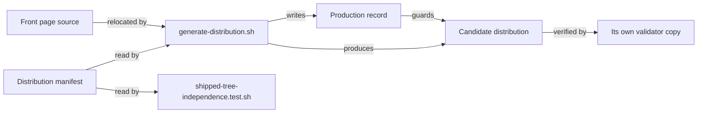

# Data Model: Distribution Packaging

**Feature**: `012-distribution-packaging` | **Date**: 2026-09-08

This feature has no runtime data store. Its entities are files with defined formats and defined
lifecycles. Each is described by its format, its validation rules, and the requirement it serves.

---

## E1. Distribution manifest

**Path**: `.highway/tools/.distribution-manifest` (hand-authored, version controlled)

**Purpose**: The single declaration of what the distribution contains. Serves FR-002, FR-003,
FR-004, FR-005, FR-019.

**Format**: One record per line. Fields tab-delimited. Lines beginning `#` are comments; blank
lines ignored.

| Field | Values | Meaning |
|---|---|---|
| `classification` | `include` \| `exclude` | Whether the source path enters the distribution |
| `source` | repository-relative path | The file or directory being classified |
| `destination` | repository-relative path \| `-` | Where it lands; `-` means unchanged |

**Validation rules**:

- Every top-level repository path, and every path needed to resolve a within-directory
  distinction, MUST appear exactly once as a `source`.
- A `source` MUST NOT appear twice, whatever its classification.
- `destination` MUST be `-` for an `exclude` record.
- A `source` MUST exist in the repository.
- The most specific matching record wins, so a directory may be `include` while a child is
  `exclude`. This is what FR-005 requires: `.github/skills/` holds both `highway-help` and eleven
  `speckit-*` adapters.

**Initial content** (22 records; the classification decision, made explicit):

| Classification | Source | Destination | Why |
|---|---|---|---|
| `exclude` | `.claude` | `-` | Directory default; `speckit-*` siblings do not ship |
| `include` | `.claude/skills/highway-help` | `-` | Product adapter |
| `exclude` | `.cursor` | `-` | Directory default |
| `include` | `.cursor/rules/highway-help.mdc` | `-` | Product adapter |
| `exclude` | `.github` | `-` | Directory default |
| `include` | `.github/skills/highway-help` | `-` | Product adapter |
| `exclude` | `.highway` | `-` | Directory default, so each child is deliberate |
| `include` | `.highway/skills` | `-` | Product |
| `include` | `.highway/library` | `-` | Product |
| `include` | `.highway/catalog` | `-` | Product |
| `include` | `.highway/governance` | `-` | The validator resolves it |
| `include` | `.highway/tools` | `-` | Recorded scope decision: authoring loop ships |
| `exclude` | `.highway/tools/tests` | `-` | Fixtures are deliberately non-conformant |
| `exclude` | `.highway/tools/generate-distribution.sh` | `-` | Packaging is a repository operation |
| `exclude` | `.highway/tools/lib/distribution.sh` | `-` | Packaging is a repository operation |
| `exclude` | `.highway/tools/.distribution-manifest` | `-` | Packaging is a repository operation |
| `include` | `.highway/DISTRIBUTION.md` | `README.md` | FR-017, FR-019: front page relocates |
| `exclude` | `.gitignore` | `-` | A distribution is not a repository |
| `exclude` | `.specify` | `-` | Development artifact |
| `exclude` | `specs` | `-` | Development artifact |
| `exclude` | `README.md` | `-` | FR-018: addresses a contributor |
| `exclude` | `governance-plan.md` | `-` | Development artifact |

**Note on the adapter entries**: the three `highway-*` records are more specific than their parent
directory records, so they ship while their siblings do not. This is what FR-005 requires.

**Note on the packaging carve-outs** (discovered during implementation, not anticipated by the
plan): the packaging tooling is excluded from the distribution it produces. A recipient never
packages, and more decisively, `generate-distribution.sh` necessarily contains the literal
development-path tokens its own first verification searches for. Including it would make every
distribution fail its own check. This also forced the classification to be evaluated **per file**
rather than per directory, since the excluded tooling sits inside an included directory.

---

## E2. Distribution front page

**Path**: `.highway/DISTRIBUTION.md` in the repository; `README.md` in the distribution.

**Purpose**: Serves FR-017 and FR-018.

**Validation rules**:

- MUST NOT be the repository's own front page.
- MUST NOT reference `.specify/` or `specs/` — it is a distributed file under D1.1.
- Every Markdown link target MUST resolve inside the distribution.
- MUST NOT describe the test suite, which the distribution does not contain.

**Why it lives under `.highway/`**: it is a distributed artifact, and its source must sit
somewhere the repository root does not already occupy. This is the sole motivation for the
manifest's destination column.

---

## E3. Production record

**Path**: `<distribution>/.highway/tools/.distribution-record` (generated)

**Purpose**: Lets a later run distinguish its own output from a hand-edit. Serves FR-013.

**Format**: One record per line, tab-delimited: `<distribution-relative path><TAB><sha256>`.

**Lifecycle**:

1. Absent target directory → produce, then write the record.
2. Present target with a valid record, every file matching → overwrite.
3. Present target with no record → refuse, naming the directory.
4. Present target with a record, but a file missing from it or hash-mismatched → refuse, naming
   the file.

**Note**: this file is inside the distribution and is itself produced by packaging, so it is
excluded from its own hash comparison.

---

## E4. Candidate distribution

**Path**: a caller-supplied directory, or a temporary directory during tests.

**Purpose**: The produced artifact. Verified as a whole before acceptance.

**State transitions**:

```text
(nothing) --produce--> candidate --verify--> accepted
                           |
                           +--verify fails--> rejected, removed, nonzero exit
```

**Validation rules** — all three must pass, per FR-011, before the candidate is accepted:

| Check | Requirement | Failure output |
|---|---|---|
| No development-path reference | FR-007 | File, line, matched token |
| Cross-references resolve | FR-008 | File, line, unresolvable target |
| Distribution's own validator succeeds | FR-009, FR-009a | The validator's own output |

A rejected candidate is removed rather than left in place, so no partially verified tree can be
mistaken for an accepted one.

---

## Entity relationships



The manifest has two readers and no second copy, which is what D1.6 requires. The independence
check adds the test directory to its own scope beyond what the manifest declares, for the reason
recorded in `research.md` R2.
