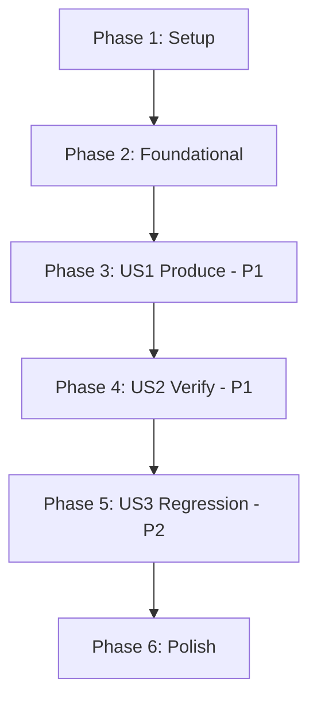

# Tasks: Distribution Packaging

**Feature**: `012-distribution-packaging` | **Date**: 2026-09-08

**Input**: [spec.md](spec.md), [plan.md](plan.md), [research.md](research.md),
[data-model.md](data-model.md), [contracts/generate-distribution.md](contracts/generate-distribution.md),
[quickstart.md](quickstart.md)

**Tests**: Test tasks are included because the specification requires them explicitly — FR-014
requires a packaging regression to fail the suite, and FR-015 requires the verification to be
demonstrably capable of failing.

**Organization**: Tasks are grouped by user story so each story is independently completable and
testable.

---

## Format

`- [ ] [TaskID] [P?] [Story?] Description with exact file path`

`[P]` marks tasks touching different files with no dependency on incomplete work.

---

## Phase 1: Setup

**Purpose**: Establish the starting state the development constitution requires.

- [X] T001 Run `.highway/tools/tests/run-all.sh` and confirm 14 passed, 0 failed. D3.1 requires a
      change to begin from a passing suite; record the count before the first edit.

---

## Phase 2: Foundational

**Purpose**: The manifest, the front page, and the shared parsing helper. Every user story depends
on these.

**⚠️ BLOCKING**: No user story phase may begin until Phase 2 is complete.

- [X] T002 Create `.highway/tools/.distribution-manifest` with the eighteen classification records
      in the table at [data-model.md](data-model.md) section E1. Tab-delimited, three fields:
      classification, source, destination. Comment lines begin `#`. The three `highway-*` adapter
      records must be more specific than their parent directory records, because
      `.github/skills/` holds both `highway-help` and eleven `speckit-*` entries that do not ship.

- [X] T003 [P] Create `.highway/DISTRIBUTION.md`, the distribution's front page, written for
      someone receiving Highway rather than contributing to it (FR-017). It must describe what a
      recipient can do — author a skill, validate it, generate adapters — and must not describe
      the test suite, which the distribution does not contain. It must contain no `.specify/` or
      `specs/` token (D1.1) and every link target must resolve inside the distribution.

- [X] T004 Create `.highway/tools/lib/distribution.sh` exposing manifest parsing used by both
      readers, so the manifest stays a single declaration under D1.6: `dist_manifest_file`,
      `dist_classify <path>` returning `include`/`exclude`/`unclassified` by most-specific match,
      `dist_included_sources`, `dist_destination <source>`, and `dist_unclassified_paths`. Use
      `grep -F` and `awk` only — no associative arrays, `mapfile`, or `readarray` (D2.1).

- [X] T005 Verify T004 against D2.1 and D2.2: confirm the file contains no `declare -A`,
      `mapfile`, `readarray`, `${var^^}`, or `&>>`, and that every external command it invokes
      appears in the constitution's Declared Toolchain.

**Checkpoint**: The classification exists and is machine-readable by two consumers.

---

## Phase 3: User Story 1 — Producing the distribution is one repeatable step (P1)

**Goal**: One command produces the distribution from the repository with no manual file selection,
and produces byte-identical output on repeat runs.

**Independent Test**: Run the packaging step against a clean checkout; the result contains the
product, contains nothing used only to build the product, and required no manual step.

- [X] T006 [US1] Create `.highway/tools/generate-distribution.sh` with the argument handling,
      usage message, and exit codes defined in
      [contracts/generate-distribution.md](contracts/generate-distribution.md). Source
      `lib/distribution.sh`. Derive `HIGHWAY_ROOT` from `SCRIPT_DIR` as the sibling scripts do.
      Read no environment variables — `CONSTITUTION_FILE` is deliberately not honored.

- [X] T007 [US1] Implement unclassified-path detection in
      `.highway/tools/generate-distribution.sh`: walk every repository path, call `dist_classify`,
      and exit 1 naming any path that resolves to `unclassified` (FR-006). This runs before any
      file is copied, so an undeclared path never reaches a distribution.

- [X] T008 [US1] Implement copying in `.highway/tools/generate-distribution.sh`: for each included
      source, copy to its destination, honoring the manifest's third column so
      `.highway/DISTRIBUTION.md` lands as `README.md` (FR-019). Copy only — never invoke a
      generator, because `generate-catalog.sh` writes a timestamp that would break FR-012.

- [X] T009 [US1] Implement the production record in `.highway/tools/generate-distribution.sh`:
      after populating the tree, write `<distribution-relative path><TAB><sha256>` for every
      produced file to `<target>/.highway/tools/.distribution-record`, excluding the record
      itself. Use the `sha256sum`-then-`shasum -a 256` fallback from
      `generate-agent-adapters.sh` so both platforms work (D2.3).

- [X] T010 [US1] Implement drift refusal in `.highway/tools/generate-distribution.sh` per
      [data-model.md](data-model.md) section E3: refuse when the target exists with no record, or
      holds a file absent from the record or hash-mismatched. Exit 1 naming the directory or file,
      wording matching `generate-agent-adapters.sh` (FR-013, D4.3). Never delete a directory the
      step did not produce.

- [X] T011 [US1] Implement the success output in `.highway/tools/generate-distribution.sh`
      matching the contract exactly: `producing distribution at <target>`, the included-path
      count, and `distribution accepted: <target>`. The output format is a contract; a later
      change to it is a behavioral change under D3.3.

- [X] T012 [US1] Verify User Story 1 by running quickstart scenarios S1, S2, S6, and S8 from
      [quickstart.md](quickstart.md). S2 must fail correctly on a seeded undeclared path and S8
      must leave a hand-authored file untouched.

**Checkpoint**: A distribution can be produced, repeatably, without overwriting anything it did
not create.

---

## Phase 4: User Story 2 — The distribution is verified before anyone receives it (P1)

**Goal**: A produced distribution is proven internally complete before it is accepted, and a
failure prevents a distribution rather than annotating one.

**Independent Test**: Take the produced distribution alone, with no access to the repository that
built it, and confirm it is internally complete and its tooling runs.

- [X] T013 [US2] Implement the development-path reference check in
      `.highway/tools/generate-distribution.sh`: search every file in the candidate for
      `.specify/` and `specs/`, reporting file, line, and matched text (FR-007, FR-010).

- [X] T014 [US2] Implement cross-reference resolution in
      `.highway/tools/generate-distribution.sh`: for each Markdown link target in the candidate,
      skip empty targets, `#` anchors, and `scheme:` URLs, then require the target to resolve
      relative to its containing file inside the candidate (FR-008). Reuse the extraction
      technique in `rc_check_P8_7` in `.highway/tools/lib/rule-checks.sh` rather than writing a
      second one that can diverge.

- [X] T015 [US2] Implement the self-validation check in
      `.highway/tools/generate-distribution.sh`: invoke
      `<candidate>/.highway/tools/validate-skill.sh` — the candidate's own copy — for every skill
      in the candidate, with `CONSTITUTION_FILE` unset (FR-009, FR-009a). Running the
      repository's copy would prove nothing: it resolves its governing document relative to its
      own location, verified 2026-09-08 to exit 0 against a tree containing neither toolchain nor
      constitution. See [research.md](research.md) R3.

- [X] T016 [US2] Implement rejection in `.highway/tools/generate-distribution.sh`: on any
      verification failure, print the failing check's detail, remove the candidate, and exit 1
      (FR-011). A partially verified tree must never be left where it could be mistaken for an
      accepted one.

- [X] T017 [US2] Verify User Story 2 by running quickstart scenarios S3, S4, and S5 from
      [quickstart.md](quickstart.md). S5's second half is the one that matters: a copy with
      `.highway/governance` deleted must exit **nonzero**. If it exits 0, the check is resolving
      something from outside the distribution and FR-009a is not met.

**Checkpoint**: No unverified distribution can be produced.

---

## Phase 5: User Story 3 — A packaging regression fails here, not at a user (P2)

**Goal**: A change that would break the distribution fails the suite rather than reaching a user.

**Independent Test**: Introduce a breaking change, run the suite, and confirm it fails and names
the cause.

- [X] T018 [US3] Create `.highway/tools/tests/distribution-packaging.test.sh`. It is discovered
      automatically — `run-all.sh` globs `*.test.sh`, so no registration is needed. Produce a
      distribution into a temporary directory, assert success, assert two runs are byte-identical
      ignoring `.distribution-record`, and clean up.

- [X] T019 [US3] Add failure probes to `.highway/tools/tests/distribution-packaging.test.sh`
      following the seeded-probe pattern in `shipped-tree-independence.test.sh`: seed an
      unclassified path, a development-path reference, an unresolvable cross-reference, and a
      candidate missing `.highway/governance`, asserting each is detected (FR-015, SC-007). Remove
      each probe with `rm`. Do not use `git checkout` to revert a probe — during feature 010 that
      reverted unrelated uncommitted work in the same file.

- [X] T020 [US3] Amend `.highway/tools/tests/shipped-tree-independence.test.sh` to build `TARGETS`
      from `dist_included_sources` in `lib/distribution.sh` instead of its own inline list, then
      **add `$HIGHWAY_ROOT/tools/tests` explicitly** with a comment recording why: the manifest
      excludes tests from the distribution, but this check scans fixtures deliberately and with no
      exemption, per feature 010. Narrowing the scanned set would weaken an assertion, which D3.5
      forbids. The scanned set must be unchanged; only its declaration moves. See
      [research.md](research.md) R2.

- [X] T021 [US3] Confirm T020 preserved scope: verify the amended test still detects a probe
      seeded inside `.highway/tools/tests/fixtures/`, which is the content the manifest excludes
      and the check must still cover.

**Checkpoint**: The distribution is protected for the life of the project.

---

## Phase 6: Polish & Cross-Cutting Concerns

- [X] T022 [P] Update `.highway/tools/README.md` to document `generate-distribution.sh` and
      `.distribution-manifest` alongside the existing tools. D6.1 requires live documentation to
      be updated in the change that invalidates it.

- [X] T023 [P] Update the Phase 3 entry in `governance-plan.md`: mark it complete with the date,
      the task count, and the test count, matching how Phases 1, 2b are recorded. Update the
      status line at the top, which currently names Phase 3 or Phase 4 as the next action.

- [X] T024 Audit the two new shell files against D2.1, D2.2, and D2.3: no Bash 4 construct, no
      utility outside the Declared Toolchain, and no flag rejected by either the GNU or Apple
      variant. Confirm no version-control command is invoked anywhere — the distribution is not a
      repository.

- [X] T025 Run `.highway/tools/tests/run-all.sh` and confirm all tests pass, including the new
      one, with no test removed or weakened (D3.2, D3.5, SC-008).

- [X] T026 Run the full quickstart end to end from [quickstart.md](quickstart.md), scenarios S1
      through S9, and confirm each expected outcome. S9 checks that the component-scope decision
      and its reversal are recorded in `governance-plan.md` (SC-009).

---

## Dependencies

**Story order is genuine, not conventional.** US2 verifies an artifact only US1 can produce, and
US3 re-runs a command only US1 and US2 define. These stories cannot be parallelized across
developers, though each remains independently testable once its predecessor is complete.

**Within-file dependency**: T006–T011 and T013–T016 all edit
`.highway/tools/generate-distribution.sh` and must run in sequence. This is why so few tasks carry
`[P]`.

---

## Parallel Opportunities

| Tasks | Why they can run together |
|---|---|
| T002, T003 | Different files: the manifest and the front page |
| T022, T023 | Different files: the tools README and the governance plan |

Genuine parallelism is limited here: one script accumulates most of the implementation. Marking
more tasks `[P]` would be inaccurate rather than faster.

---

## Implementation Strategy

**MVP scope**: Phases 1–3 (T001–T012). That produces a distribution and makes it repeatable. It is
deliberately *not* a shippable outcome — an unverified distribution reproduces the exact defect
this governance effort exists to remove, a green development tree beside a broken product.

**Recommended increment**: Phases 1–4 (T001–T017). US1 and US2 are both P1 because producing
without verifying is not worth doing.

**Deferrable**: Phase 5 protects the outcome for the life of the project but delivers nothing
until Phases 3 and 4 exist. It should not be deferred long — FR-014 exists because the break it
catches is invisible locally.

---

## Task Summary

| Phase | Tasks | Count |
|---|---|---|
| 1 — Setup | T001 | 1 |
| 2 — Foundational | T002–T005 | 4 |
| 3 — US1 Produce (P1) | T006–T012 | 7 |
| 4 — US2 Verify (P1) | T013–T017 | 5 |
| 5 — US3 Regression (P2) | T018–T021 | 4 |
| 6 — Polish | T022–T026 | 5 |
| **Total** | | **26** |

**Files created**: `.highway/tools/.distribution-manifest`, `.highway/DISTRIBUTION.md`,
`.highway/tools/lib/distribution.sh`, `.highway/tools/generate-distribution.sh`,
`.highway/tools/tests/distribution-packaging.test.sh`

**Files amended**: `.highway/tools/tests/shipped-tree-independence.test.sh`,
`.highway/tools/README.md`, `governance-plan.md`
