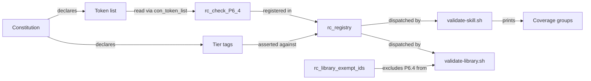

# Data Model: Auto-Tier Honesty

**Feature**: `013-auto-tier-honesty` | **Date**: 2026-09-08

No runtime data store. The entities are the constitution's own structures and the registry that
claims to enforce them.

---

## E1. Tier tag

**Location**: The fourth column of every rule row in `.highway/governance/constitution.md`.

**Values**: `[auto]`, `[agent-checkable]`, `[human-review]`.

**Meaning**: A claim about how the rule is decided. `[auto]` claims a script decides it.

**Validation rule** (new, enforced by this feature): every rule tagged `[auto]` has a registered
check. The set difference `con_rule_ids_by_tier <file> auto` minus `rc_registered_ids` is empty.

**Transitions in this feature**:

| Rule | From | To | Cause |
|---|---|---|---|
| P2.3 | `[auto]` | `[agent-checkable]` | Deciding "technology-specific example" is semantic |
| P6.4 | `[auto]` | `[auto]` (unchanged) | Gains a real check instead |

---

## E2. Prohibited nondeterministic criterion tokens

**Location**: A new section in `.highway/governance/constitution.md`, formatted as a heading
followed by a blockquote, matching `### Prohibited Vagueness List`.

**Read by**: `con_token_list "$constitution" "<heading>"`, which already exists and requires no
change.

**Content**: Three groups of vocabulary a decision criterion must not reference.

| Group | Examples of the vocabulary declared |
|---|---|
| Time | `today`, `currently`, `now`, `recently`, `latest`, `clock` |
| Randomness | `random`, `randomly`, `arbitrary`, `arbitrarily`, `any of` |
| Agent preference | `prefer`, `preferred`, `preferably`, `idiomatic`, `cleaner`, `nicer` |

The exact list is settled during implementation. What matters structurally is that it lives in the
constitution, where it is reviewable and amendable, rather than inside a script.

**Why declared rather than hard-coded**: the list is a normative boundary. A reader deciding
whether their criterion complies must be able to see it, and changing it must be an amendment.

---

## E3. Rule check registry

**Location**: `rc_registry()` in `.highway/tools/lib/rule-checks.sh`.

**Format**: Tab-delimited rows, `ID<TAB>function<TAB>na_condition`, inside a heredoc indented with
**two tabs**.

**Change**: one row added, `P6.4	rc_check_P6_4	-`, taking the registry from 13 rows to 14.

**Hazard**: an edit using three tabs is accepted silently, leaves the suite green, and never
dispatches the check. Verify with `rc_check_fn P6.4` directly. This is recorded because it
happened during feature 011.

---

## E4. Library exemption list

**Location**: `rc_library_exempt_ids()` in `.highway/tools/lib/rule-checks.sh`.

**Current value**: `P8.7`.

**Change**: becomes `P8.7 P6.4`.

**Why**: `validate-library.sh` shares the registry. P6.4 governs a skill's decision criteria;
library files have no such sections and must not be judged by a rule written for skills.

---

## E5. Coverage group membership

**Location**: The summary printed by `validate-skill.sh`, five groups, each rule id in exactly
one.

**Transitions**:

| Rule | Before | After | Why |
|---|---|---|---|
| P2.3 | `UNCHECKED` | `DEFERRED` | Retagged; agent-checkable rules are deferred |
| P6.4 | `UNCHECKED` | `CHECKED` or `FAILED` | Now decided by a registered check |

**Resulting invariant**: `UNCHECKED` is empty for every skill. This is the feature's observable
outcome and the first thing to look at when verifying it.

**Note**: the group *format* is a contract and does not change. Only membership does.

---

## E6. Follow-up entry

**Location**: The Sync Impact Report at the top of the constitution.

**Current value**: one entry, `TODO(AUTO_TIER_ENFORCEMENT)`.

**Change**: removed, with the evidence that closed it recorded — as feature 011 did for the three
entries it cleared. The follow-up list becomes empty.

---

## Relationships

The arrow from tier tags to the registry is the one this feature adds. It is what makes the
constitution's claim about itself checkable rather than merely stated.
