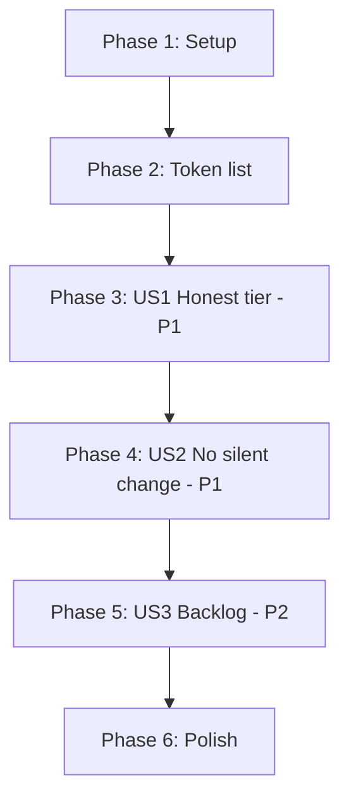

# Tasks: Auto-Tier Honesty

**Feature**: `013-auto-tier-honesty` | **Date**: 2026-09-08

**Input**: [spec.md](spec.md), [plan.md](plan.md), [research.md](research.md),
[data-model.md](data-model.md), [contracts/coverage-summary.md](contracts/coverage-summary.md),
[quickstart.md](quickstart.md)

**Tests**: Test tasks are included because the specification requires them explicitly — FR-010
requires the new check to be demonstrated failing, and FR-015 requires a regression to fail the
suite.

**Organization**: Tasks are grouped by user story so each story is independently completable.

---

## Format

`- [ ] [TaskID] [P?] [Story?] Description with exact file path`

---

## Phase 1: Setup

- [X] T001 Run `.highway/tools/tests/run-all.sh` and confirm 15 passed, 0 failed. D3.1 requires a
      change to begin from a passing suite; record the count before the first edit.

---

## Phase 2: Foundational

**Purpose**: The token list P6.4's check depends on. Nothing in User Story 1 can proceed without
it.

**⚠️ BLOCKING**: User story phases must not begin until Phase 2 is complete.

- [X] T002 Add a prohibited nondeterministic criterion token list to
      `.highway/governance/constitution.md`, as a heading followed by a blockquote, matching the
      shape of `### Prohibited Vagueness List` so `con_token_list()` parses it without change.
      Three groups per [data-model.md](data-model.md) E2: time, randomness, agent preference.
      Place it near the existing vagueness list, not inside a rule table.

- [X] T003 Verify the list is readable:
      `con_token_list .highway/governance/constitution.md "<heading>"` returns the tokens, one per
      line, with no blank entries. If it returns nothing, the blockquote formatting does not match
      what the parser expects.

**Checkpoint**: The normative vocabulary exists in the constitution, where a reader can see it.

---

## Phase 3: User Story 1 — The auto tier stops promising enforcement it does not deliver (P1)

**Goal**: Every rule tagged `[auto]` is decided automatically; no rule tagged `[auto]` appears as
unchecked.

**Independent Test**: Read the tier tag of every rule, run the validator, and compare. The
unchecked group is empty.

- [X] T004 [US1] Implement `rc_check_P6_4()` in `.highway/tools/lib/rule-checks.sh`. Scope it to
      the `When to use` and `When not to use` sections using `bs_scan`, skip fenced blocks, and
      match tokens read via `con_token_list()`. **Do not register it yet** — T005 must evaluate it
      against every fixture first, per D3.4.

- [X] T005 [US1] Evaluate `rc_check_P6_4` against all seven skill fixtures under
      `.highway/tools/tests/fixtures/`, plus `valid-skill`, plus `.highway/skills/highway-help`,
      and record each expected verdict in a table before enabling it (FR-008, D3.4). The hazard is
      specific: a fixture asserting exactly one failure that quietly begins producing two. Any
      fixture this check would newly fail must be resolved here, not discovered later.

- [X] T006 [US1] Register the check by adding the row `P6.4	rc_check_P6_4	-` to `rc_registry()`
      in `.highway/tools/lib/rule-checks.sh`. The heredoc is indented with **two tabs** — an edit
      using three is accepted silently, leaves the suite green, and never dispatches the check.

- [X] T007 [US1] Verify dispatch directly:
      `bash -c 'source .highway/tools/lib/rule-checks.sh; rc_check_fn P6.4'` must print
      `rc_check_P6_4`. A green suite is not evidence here — during feature 011 a check passed
      every test while never being called.

- [X] T008 [US1] Add `P6.4` to `rc_library_exempt_ids()` in `.highway/tools/lib/rule-checks.sh`
      (FR-011). `validate-library.sh` shares the registry, and a library file has no
      decision-criteria sections; without this it would be judged by a rule written for skills.

- [X] T009 [US1] Retag `P2.3` from `[auto]` to `[agent-checkable]` in
      `.highway/governance/constitution.md` (FR-003). Change the tier column only — the rule text
      and Observable are unchanged.

- [X] T010 [US1] Update the version and Sync Impact Report in
      `.highway/governance/constitution.md`: `2.1.0 → 2.2.0`, MINOR. Record the classification
      against the policy's text, per [research.md](research.md) R3: MINOR because a **section** is
      added; the retag alone would have been PATCH by elimination. Record the P2.3 retag and its
      reason (FR-006, FR-007).

- [X] T011 [US1] Add the tier-honesty guard to
      `.highway/tools/tests/constitution-inventory.test.sh`: assert that
      `con_rule_ids_by_tier <skills constitution> auto` minus `rc_registered_ids` is empty. **Name
      the covered document in the failure message and in a comment** (FR-016). The development
      constitution has the same defect, and a guard that appears to cover governance generally
      would convert an open gap into an apparently closed one.

- [X] T012 [US1] Prove the guard can fail: copy the constitution aside, retag one
      `[agent-checkable]` rule to `[auto]`, confirm
      `.highway/tools/tests/constitution-inventory.test.sh` exits nonzero and names that rule, then
      restore from the copy. Restore with `cp` from the backup — do **not** use version control to
      revert, which discarded unrelated uncommitted work during feature 010.

- [X] T013 [US1] Verify the story: run quickstart scenarios S1, S2, S3 and S5 from
      [quickstart.md](quickstart.md). S1 is the headline — `UNCHECKED:` must be empty where it
      previously read `UNCHECKED: P2.3 P6.4`.

**Checkpoint**: The tier tag tells the truth for every rule.

---

## Phase 4: User Story 2 — A new check does not silently change existing verdicts (P1)

**Goal**: The new check is demonstrated failing, and no pre-existing fixture verdict changed
undeliberately.

**Independent Test**: Compare every fixture's verdict against the record made in T005.

- [X] T014 [US2] Create the fixture
      `.highway/tools/tests/fixtures/invalid-skill-nondeterministic-criterion/SKILL.md`, valid in
      every other respect, whose `When to use` section references a prohibited token. It must
      violate exactly one rule, so `assert_single_failure` remains meaningful.

- [X] T015 [US2] Add cases to `.highway/tools/tests/rule-checks.test.sh`: one asserting
      `rc_check_P6_4` reports a violation and names the offending token, and one false-positive
      case asserting a criterion using none of the vocabulary passes. The file's completeness loop
      requires every registered rule to have a seeded case, so T006 without this reds the suite.

- [X] T016 [US2] Add assertions to `.highway/tools/tests/validate-skill.test.sh` that the new
      fixture exits nonzero and produces exactly one failure, reported under `P6.4` (FR-004,
      FR-010).

- [X] T017 [US2] Confirm every pre-existing fixture's verdict matches the table recorded in T005
      (FR-009, SC-005). Compare against the record, not against memory.

- [X] T018 [US2] Verify the story: run quickstart scenarios S4, S6 and S7 from
      [quickstart.md](quickstart.md). S6 confirms library files are exempt; S7 confirms no fixture
      verdict drifted.

**Checkpoint**: The check is proven to work and proven not to have broken anything else.

---

## Phase 5: User Story 3 — The follow-up backlog reflects reality (P2)

**Goal**: No entry describes a gap that no longer exists, and no corrected figure remains wrong.

**Independent Test**: Read the Sync Impact Report and confirm nothing describes an open auto-tier
gap.

- [X] T019 [US3] Remove `TODO(AUTO_TIER_ENFORCEMENT)` from the Sync Impact Report in
      `.highway/governance/constitution.md`, recording the evidence that closed it: P6.4 is
      decided by `rc_check_P6_4`, P2.3 is retagged, and the guard added in T011 keeps it true
      (FR-012, FR-013). State the evidence rather than asserting closure, as feature 011 did for
      the three entries it cleared.

- [X] T020 [US3] Confirm `grep -c 'TODO(' .highway/governance/constitution.md` returns `0`
      (SC-006).

- [X] T021 [US3] Verify the correction already applied to `governance-plan.md` during planning is
      accurate and complete (FR-014): Phase 4 states two rules rather than fourteen, and Appendix
      A's "ten of the twenty-five" is left **unchanged** because it describes the development
      constitution and is correct. This task verifies rather than edits.

**Checkpoint**: Every gap record in the repository is either true or gone.

---

## Phase 6: Polish & Cross-Cutting Concerns

- [X] T022 Cite `P6.4` and the token list from `.highway/skills/_authoring-standard.md`, by rule
      id and without restating rule text (P7.3). An author must be able to read the constraint
      rather than discover it by failing — the gap Phase 2b of the governance plan existed to
      close. **This task modifies a file under `.highway/skills/`, so it triggers the Skill
      Content Gate**; the plan's Constitution Check is corrected accordingly.

- [X] T023 Run `.highway/tools/tests/authoring-standard.test.sh` and confirm the citation count
      assertion still passes and no rule text was restated by T022.

- [X] T024 Run `.highway/tools/tests/run-all.sh` and confirm all tests pass, count no lower than
      15, with no test removed or weakened (D3.2, D3.5, SC-007).

- [X] T025 Run quickstart scenarios S8 through S11 from [quickstart.md](quickstart.md). S11
      matters most: the constitution ships, so the distribution must still build and its own
      validator must still succeed using only what the distribution contains.

- [X] T026 Update the Phase 4 entry in `governance-plan.md` to complete, with the date, task count
      and test count, matching how Phases 1, 2b and 3 are recorded. Update the status line, which
      currently reads "Phase 4 in progress".

---

## Dependencies

**The critical ordering is inside US1, not between stories**: T004 → T005 → T006. The check must
be written, then evaluated against every fixture, then registered. Registering before evaluating
is the D3.4 violation this sequence exists to prevent, and it is the specific mistake that nearly
shipped in feature 009.

**Within-file dependency**: T004, T006 and T008 all edit `.highway/tools/lib/rule-checks.sh`;
T002, T009, T010 and T019 all edit `.highway/governance/constitution.md`. Both sets are strictly
sequential, which is why almost no task carries `[P]`.

---

## Parallel Opportunities

Effectively none. Two files absorb most of the work, and the one genuinely orderable pair —
writing the check and writing its fixture — is deliberately separated by the D3.4 evaluation step.
Marking tasks `[P]` here would be inaccurate rather than faster.

---

## Implementation Strategy

**MVP scope**: Phases 1–3 (T001–T013). The tier becomes honest and stays honest. This is a
coherent stopping point.

**Do not stop before Phase 4.** US1 and US2 are both P1 because a check that has never been
observed rejecting anything proves nothing about what it accepts. T013 confirms the unchecked
group is empty; only T016 confirms the check is real.

**Phase 5 is genuinely deferrable**, and is the only part that is. It corrects records rather than
behaviour.

---

## Task Summary

| Phase | Tasks | Count |
|---|---|---|
| 1 — Setup | T001 | 1 |
| 2 — Foundational | T002–T003 | 2 |
| 3 — US1 Honest tier (P1) | T004–T013 | 10 |
| 4 — US2 No silent change (P1) | T014–T018 | 5 |
| 5 — US3 Backlog (P2) | T019–T021 | 3 |
| 6 — Polish | T022–T026 | 5 |
| **Total** | | **26** |

**Files created**: `.highway/tools/tests/fixtures/invalid-skill-nondeterministic-criterion/SKILL.md`

**Files amended**: `.highway/governance/constitution.md`, `.highway/tools/lib/rule-checks.sh`,
`.highway/tools/tests/constitution-inventory.test.sh`, `.highway/tools/tests/rule-checks.test.sh`,
`.highway/tools/tests/validate-skill.test.sh`, `.highway/skills/_authoring-standard.md`,
`governance-plan.md`
