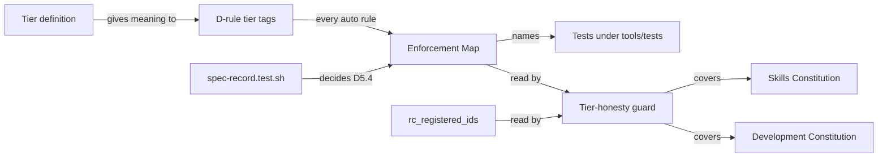

# Data Model: Development Tier Honesty

**Feature**: `014-dev-tier-honesty` | **Date**: 2026-09-08

No runtime data store. The entities are sections of a governance document and the assertion that
checks them.

---

## E1. Tier definition for Layer 0

**Location**: A statement in `.specify/memory/constitution.md`, alongside the tier tags it
governs.

**Content**: What `[auto]` obliges for a rule in that document — a test in `run-all.sh` decides
the rule, and the Enforcement Map records which test. Plus an explicit note that this differs from
the Layer 1 meaning, which additionally requires per-rule reporting.

**Why it must be in the document**: a tier tag is read by someone holding the constitution. A
definition living in a spec directory, which does not ship and which a reader has no reason to
open, is not a definition they have.

---

## E2. Enforcement Map

**Location**: A new section of `.specify/memory/constitution.md`.

**Purpose**: Binds each `[auto]` rule to the test that decides it. Serves FR-001, FR-005, FR-010.

**Format**: A table, one row per `[auto]` rule.

| Field | Meaning |
|---|---|
| Rule | The `D` rule id |
| Enforced by | The test file under `.highway/tools/tests/` that decides it |
| Note | What the test actually asserts, where that is not obvious from its name |

**Validation rules**:

- Every rule tagged `[auto]` MUST appear exactly once.
- No rule tagged otherwise may appear.
- Every named test file MUST exist.

**Provisional content** — each row to be re-verified during implementation, not trusted from here:

| Rule | Enforced by | Note |
|---|---|---|
| D1.1 | `shipped-tree-independence.test.sh` | Seeds a probe to prove it can fail |
| D1.2 | `distribution-packaging.test.sh` | Runs the distribution's own validator |
| D4.2 | `generate-catalog.test.sh` | Encodes the `generated_at` exception the Observable names |
| D4.3 | `distribution-packaging.test.sh` | Asserts refusal to overwrite an untracked target |
| D4.1 | *to be confirmed* | Generator no-diff coverage |
| D6.2 | *open* | Enforced inside the distribution only; see research R2 |
| D5.4 | `spec-record.test.sh` (new) | Contiguous feature numbering |

**Rules leaving the map**: D3.1, D3.2, and D4.4 are retagged rather than mapped.

---

## E3. Tier tag transitions

| Rule | From | To | Cause |
|---|---|---|---|
| D3.1 | `[auto]` | `[agent-checkable]` | A claim about the suite state before the first edit |
| D3.2 | `[auto]` | `[agent-checkable]` | A claim about the suite state after the final edit |
| D4.4 | `[auto]` | `[agent-checkable]` | A claim about what a person did after changing a generator |
| D5.4 | `[auto]` | `[auto]` (unchanged) | Gains a real check instead |

Expected tier counts afterward: `[auto]` 10 → 7, `[agent-checkable]` 14 → 17, `[human-review]` 1
unchanged. D6.2's disposition may change these by one.

---

## E4. Tier-honesty guard

**Location**: `.highway/tools/tests/constitution-inventory.test.sh`, extending the assertion
feature 013 added.

**Behaviour, per document**:

| Document | Assertion |
|---|---|
| Highway Skills Constitution | Every `[auto]` rule id appears in `rc_registered_ids` |
| Highway Development Constitution | Every `[auto]` rule id appears in the Enforcement Map, and the test file it names exists |

**Failure output**: names the offending rule **and** its document, per FR-011.

**What it deliberately does not check**: that the named test genuinely decides the rule. That is a
human judgement recorded when the row is written. The guard catches the failure that actually
happened — a tag with nothing behind it — and the one most likely next, a map row pointing at a
renamed or deleted test.

---

## E5. Spec record check

**Location**: `.highway/tools/tests/spec-record.test.sh` (new).

**Purpose**: Enforces D5.4. Serves FR-007.

**Assertion**: Feature directory numbers under `specs/` are contiguous from `001`, with no gap and
no duplicate.

**Must be capable of failing**: exercised against a temporary directory listing with a seeded gap,
following the probe pattern used elsewhere in the suite.

**Note**: this file lives under `.highway/tools/tests/`, which the distribution manifest excludes,
so it satisfies FR-015 without a manifest change.

---

## Relationships

The two arrows into the guard are the point: one guard, two documents, two definitions, because
the definitions genuinely differ and the document says so.
