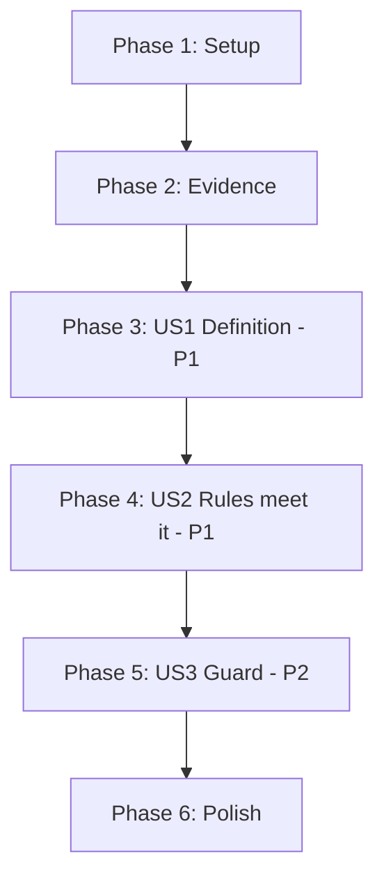

# Tasks: Development Tier Honesty

**Feature**: `014-dev-tier-honesty` | **Date**: 2026-09-08

**Input**: [spec.md](spec.md), [plan.md](plan.md), [research.md](research.md),
[data-model.md](data-model.md), [contracts/tier-honesty-guard.md](contracts/tier-honesty-guard.md),
[quickstart.md](quickstart.md)

**Tests**: Test tasks are included because the specification requires them explicitly — FR-014
requires each new check to be demonstrated failing, and FR-010 requires the guard to cover both
constitutions.

**Organization**: Grouped by user story. User Story 1 is a genuine prerequisite: until `[auto]` has
a stated meaning for Layer 0, no rule's disposition can be decided.

---

## Format

`- [ ] [TaskID] [P?] [Story?] Description with exact file path`

---

## Phase 1: Setup

- [X] T001 Run `.highway/tools/tests/run-all.sh` and confirm 15 passed, 0 failed. D3.1 requires a
      change to begin from a passing suite; record the count before the first edit.

---

## Phase 2: Foundational — establish the evidence

**Purpose**: The provisional mappings in [research.md](research.md) R2 are stated as provisional
on purpose. Deciding a rule's disposition from an unverified table is how the tier became
dishonest in the first place.

**⚠️ BLOCKING**: No user story phase may begin until Phase 2 is complete.

- [X] T002 For each of D1.1, D1.2, D4.1, D4.2, D4.3, verify empirically which test decides it, and
      record the result in a table: the test file, the assertion that does the deciding, and
      whether it covers the rule's Observable fully or partially. Read the assertions; do not
      infer from the test's filename.

- [X] T003 Gather the D6.2 evidence the plan deliberately lacks: count how many repository
      documents would fail a whole-tree cross-reference check today. This decides between widening
      the check and narrowing the Observable to the packaged tree, and the two have very different
      costs. Record the count and the decision with its reason.

**Checkpoint**: Every disposition decision now rests on evidence rather than on the plan's
provisional table.

---

## Phase 3: User Story 1 — What `[auto]` claims for a Layer 0 rule is written down (P1)

**Goal**: The document states what its own tier tag obliges, and how that differs from the Layer 1
meaning.

**Independent Test**: Read the document, find the statement, apply it to any rule, get one answer.

- [X] T004 [US1] Add a tier definition to `.specify/memory/constitution.md` stating that `[auto]`
      obliges a test in `run-all.sh` to decide the rule, with the Enforcement Map recording which
      test (FR-001, FR-002). Place it with the tier tags it governs, not in an appendix.

- [X] T005 [US1] In the same statement, record explicitly that this differs from the Layer 1
      meaning, which additionally requires reporting under the rule id, and record why the same
      tag is nonetheless retained (FR-003, FR-004). Research R1 holds the reasoning: `[test-enforced]`
      was rejected because it would imply the Layer 1 tier is something other than test-enforced,
      which it is not.

- [X] T006 [US1] Add the Enforcement Map section to `.specify/memory/constitution.md`, one row per
      `[auto]` rule, in the format given in
      [contracts/tier-honesty-guard.md](contracts/tier-honesty-guard.md). Populate it from the
      verified table produced by T002, not from the plan's provisional one.

- [X] T007 [US1] Verify the definition yields exactly one verdict for each of the three rule
      classes — enforced-but-unnamed, process-across-time, and unenforced-but-checkable — by
      applying it to D1.1, D3.1 and D5.4 in turn (FR-002). A definition that leaves any of the
      three ambiguous is not finished.

**Checkpoint**: `[auto]` means something specific in this document, and a reader can apply it.

---

## Phase 4: User Story 2 — Every `[auto]` rule in the document meets that definition (P1)

**Goal**: Ten rules each satisfy the definition, are made to satisfy it, or carry a truthful tier.

**Independent Test**: For each rule tagged `[auto]`, confirm it meets the recorded definition.

- [X] T008 [US2] Retag D3.1, D3.2 and D4.4 to `[agent-checkable]` in
      `.specify/memory/constitution.md` (FR-006). Rule text and Observables are unchanged. Each
      constrains process across time — two moments, or what a person did between them — which no
      check run at one moment can decide, while an agent can.

- [X] T009 [US2] Create `.highway/tools/tests/spec-record.test.sh` asserting that feature directory
      numbers under `specs/` are contiguous from `001` with no gap and no duplicate (FR-007). It is
      discovered automatically — `run-all.sh` globs `*.test.sh`. D5.4 is enforced rather than
      retagged because it is trivially checkable, and FR-007 requires that choice.

- [X] T010 [US2] Prove the D5.4 check can fail: create a directory that leaves a gap, confirm the
      test exits nonzero and names it, then remove it with `rmdir` (FR-014). Do not use version
      control to revert the probe — during feature 010 that discarded unrelated uncommitted work.
      Note for D3.4: this check reads directory names under `specs/` and touches no fixture, so no
      existing fixture verdict can change; confirm rather than assume.

- [X] T011 [US2] Apply the D6.2 decision recorded in T003 to `.specify/memory/constitution.md`:
      either widen the enforcing check to the repository tree and map the rule, or narrow its
      Observable to the packaged tree and record why that is the honest scope. If the Observable
      changes, re-check the version classification — the plan assumes only a section was added.

- [X] T012 [US2] Update the version and Sync Impact Report in `.specify/memory/constitution.md`:
      `1.0.0 → 1.1.0`, MINOR. Justify against the policy's text per [research.md](research.md) R5 —
      MINOR because a section is added; record that enabling D5.4's check invalidates no
      conforming work because `001`–`014` are contiguous, which is what keeps it out of MAJOR.
      Record each retag and its reason (FR-008, FR-009).

- [X] T013 [US2] Verify the story by running quickstart scenarios S2, S3 and S4 from
      [quickstart.md](quickstart.md). S2 must report every `[auto]` rule as mapped, and S3 must
      report no missing test file.

**Checkpoint**: Every tier tag in the document is true. The guard can now be extended safely.

---

## Phase 5: User Story 3 — Neither constitution can drift back (P2)

**Goal**: One guard, both documents, each failure naming its document.

**Independent Test**: Retag a rule to `[auto]` in either document without satisfying the
definition; the suite fails and names both the rule and the document.

**⚠️ ORDERING**: This phase must not begin until Phase 4 is complete. Extending the guard to a
document that does not yet satisfy the definition turns the suite red, leaving only two ways
forward — tolerating a red suite, which D3.1 and D3.2 forbid, or weakening the guard to get green,
which D3.5 forbids. FR-012 exists to remove that dilemma rather than manage it.

- [X] T014 [US3] Extend the guard in `.highway/tools/tests/constitution-inventory.test.sh` to cover
      the development constitution: every `[auto]` `D` rule appears in the Enforcement Map, and the
      test file it names exists (FR-010). Keep the skills-side assertion as it is — the two
      documents have different definitions and the guard must apply each correctly.

- [X] T015 [US3] Make every guard failure name its document, per
      [contracts/tier-honesty-guard.md](contracts/tier-honesty-guard.md) (FR-011). Update the
      comment feature 013 left, which currently states the guard covers one document deliberately;
      that note is now wrong and D6.1 requires it to change in the same edit.

- [X] T016 [US3] Prove the guard fails for each document independently, using quickstart S5: retag
      a rule in the skills constitution, confirm the failure names *that* document; restore; repeat
      for the development constitution. Restore from a `cp` backup both times.

- [X] T017 [US3] Prove a stale map row is caught, using quickstart S6: point a map row at a
      nonexistent test and confirm the failure names the rule and the missing file. This is the
      failure mode most likely to appear next, when a test is renamed.

- [X] T018 [US3] Remove `TODO(D_AUTO_TIER_ENFORCEMENT)` from the Sync Impact Report in
      `.specify/memory/constitution.md`, recording the evidence that closed it (FR-016): which
      rules are mapped, which were retagged and why, and that the guard now fails if either
      document drifts. State the evidence rather than asserting closure.

- [X] T019 [US3] Confirm `grep -c 'TODO(' .specify/memory/constitution.md` returns `0` (SC-007).

---

## Phase 6: Polish & Cross-Cutting Concerns

- [X] T020 Confirm nothing this feature added reaches the distribution, using quickstart S8
      (FR-015, SC-009): the distribution builds, and searching it for the new test and for the
      Enforcement Map returns nothing. Both live under paths the manifest already excludes, so no
      manifest change should be needed — if one is, the packaging classification must be revisited
      in the same change.

- [X] T021 Audit `.highway/tools/tests/spec-record.test.sh` against D2.1, D2.2 and D2.3: no Bash 4
      construct, no utility outside the Declared Toolchain, no flag rejected by either the GNU or
      Apple variant.

- [X] T022 Run `.highway/tools/tests/run-all.sh` and confirm all tests pass, count no lower than
      16, with no test removed or weakened (D3.2, D3.5, SC-008).

- [X] T023 Run the full quickstart, S1 through S9, from [quickstart.md](quickstart.md), and
      confirm each expected outcome.

- [X] T024 Update the Phase 4b entry in `governance-plan.md` to complete, with the date, task count
      and test count, matching how Phases 1, 2b, 3 and 4 are recorded. Update the status line, and
      record the definitional decision — that `[auto]` means something different for Layer 0 — since
      that is the finding most likely to be needed again.

---

## Dependencies

**Every arrow here is a real constraint, not convention.** T002 and T003 gather the evidence the
dispositions depend on. User Story 1 defines the term User Story 2 applies. User Story 3 cannot
start before User Story 2 finishes without turning the suite red — the ordering FR-012 exists for.

**Within-file dependency**: T004, T005, T006, T008, T011, T012 and T018 all edit
`.specify/memory/constitution.md`; T014 and T015 both edit
`constitution-inventory.test.sh`. Both sets are strictly sequential.

---

## Parallel Opportunities

| Tasks | Why they can run together |
|---|---|
| T002, T003 | Different rules, different evidence, no shared file |

Otherwise none. One document absorbs most of the work, and the phase ordering is a dependency
chain rather than a convenience. Marking more tasks `[P]` would be inaccurate.

---

## Implementation Strategy

**MVP scope**: Phases 1–4 (T001–T013). The tier becomes honest. This is a coherent stopping point
and delivers the whole of what the feature is named for.

**Phase 5 is what makes it last.** Without it the tier is honest today and unwatched tomorrow,
which is precisely how it got into this state — feature 013 scoped its guard to one document and
recorded that the other was uncovered, and that note is the only reason this feature exists.

**Phase 6 is deferrable** except T022, which D3.2 requires.

---

## Task Summary

| Phase | Tasks | Count |
|---|---|---|
| 1 — Setup | T001 | 1 |
| 2 — Foundational evidence | T002–T003 | 2 |
| 3 — US1 Definition (P1) | T004–T007 | 4 |
| 4 — US2 Rules meet it (P1) | T008–T013 | 6 |
| 5 — US3 Guard (P2) | T014–T019 | 6 |
| 6 — Polish | T020–T024 | 5 |
| **Total** | | **24** |

**Files created**: `.highway/tools/tests/spec-record.test.sh`

**Files amended**: `.specify/memory/constitution.md`,
`.highway/tools/tests/constitution-inventory.test.sh`, `governance-plan.md`

**Files deliberately not touched**: anything under `.highway/tools/lib/`, `.highway/skills/`,
`.highway/library/`, or `.highway/governance/`. Keeping out of those is what makes the Packaging
Gate and Skill Content Gate honestly N/A.
