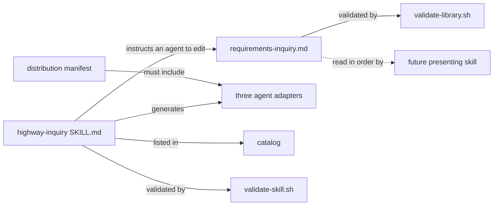

# Data Model: Requirements Inquiry Skill

**Feature**: `015-requirements-inquiry` | **Date**: 2026-09-08

No runtime data store. The entities are two Markdown files and the manifest rows that carry one of
them to users.

---

## E1. The questionnaire

**Path**: `.highway/library/templates/requirements-inquiry.md`. Ships in the library, so a
recipient finds it in their own workspace.

**Structure**:

```text
---
name: requirements-inquiry
description: "<under 500 characters>"
metadata:
  version: MAJOR.MINOR.PATCH
---

## Purpose
<exactly one sentence>

## Verification
<non-empty>

## <Section name>
1. <question text>
2. <question text>

## <Section name>
3. <question text>
```

**Validation rules** — all five are decided by `validate-library.sh`, verified 2026-09-08:

| Rule | Requirement |
|---|---|
| SCHEMA | `name` present |
| SCHEMA | `description` present, under 500 characters |
| P7.2 | `metadata.version` matches MAJOR.MINOR.PATCH |
| P7.1 | `## Purpose` present, containing **exactly one sentence** |
| P8.3 | `## Verification` present and non-empty |

**Additional rules this feature imposes**:

- Question numbering is contiguous from 1 with no gap and no duplicate.
- Numbering runs across the whole file, not per section, because it expresses the order questions
  are asked and that order is global.
- No two questions have identical text, so an answer can be keyed by text rather than by a number
  that changes.
- Content is a function of the questions, their sections, and their order — no timestamp.

**The fragile one**: P7.1's single sentence. The skill rewrites this file on every action, so a
Purpose that grows a second sentence fails on every user's machine at once.

---

## E2. The skill

**Path**: `.highway/skills/highway-inquiry/SKILL.md`.

**Frontmatter**: `name`, `description`, `usage`, `compatibility`, `metadata.version` — the shape
`highway-help` carries.

**Required body sections**, all eight, enforced by `validate-skill.sh`:

`Purpose`, `When to use`, `When not to use`, `Inputs`, `Outputs`, `Verification`,
`Error Handling`, `Example`.

**Content note**: the skill's body is instructions an agent follows. The specification's
behavioural requirements — determining intent, asking rather than guessing, challenging a weak
question — live here as prose, and their quality is the precision of that prose.

**Two rules that constrain the wording specifically**:

- **P8.7**: no Markdown link may target a relative path. The skill must *name*
  `.highway/library/templates/requirements-inquiry.md` rather than link to it.
- **P6.4**: the `When to use` and `When not to use` sections must avoid the prohibited
  nondeterministic vocabulary — no `currently`, `latest`, `preferably`, and the rest of the
  declared list.

---

## E3. Distribution manifest rows

**Path**: `.highway/tools/.distribution-manifest`.

**Change**: three rows added, so the new skill's adapters reach users.

| Classification | Source | Why |
|---|---|---|
| `include` | `.github/skills/highway-inquiry` | Product adapter |
| `include` | `.claude/skills/highway-inquiry` | Product adapter |
| `include` | `.cursor/rules/highway-inquiry.mdc` | Product adapter |

**Why this is needed**: the manifest classifies adapters by exact path. Without these rows the
adapters match the parent `exclude` and are silently omitted — the skill ships, its adapters do
not, and packaging reports success. See research R3.

---

## E4. Generated artifacts requiring regeneration

Adding a skill changes generated output. Both generators must run, and their outputs are recorded
in manifests that refuse hand-edits.

| Artifact | Generator |
|---|---|
| `.highway/catalog/index.json`, `index.md` | `generate-catalog.sh` |
| `.github/skills/highway-inquiry/SKILL.md` | `generate-agent-adapters.sh` |
| `.claude/skills/highway-inquiry/SKILL.md` | `generate-agent-adapters.sh` |
| `.cursor/rules/highway-inquiry.mdc` | `generate-agent-adapters.sh` |

---

## Relationships



The dashed arrow is the one that shapes the format: a future skill reads the questionnaire in
order. It re-reads the file rather than caching numbers, which is why numbering can renumber
freely — and why question text must be unique, so answers can be keyed by something that does not
change.
