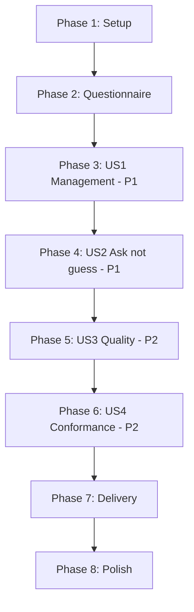

# Tasks: Requirements Inquiry Skill

**Feature**: `015-requirements-inquiry` | **Date**: 2026-09-08

**Input**: [spec.md](spec.md), [plan.md](plan.md), [research.md](research.md),
[data-model.md](data-model.md),
[contracts/questionnaire-format.md](contracts/questionnaire-format.md),
[quickstart.md](quickstart.md)

**Tests**: One test is added, for the delivery defect planning uncovered. The skill's behavioural
requirements are prose an agent follows and are verified by following it, not by the suite —
research R1 explains why, and the task list marks which verifications are which.

**Organization**: Grouped by user story, with one phase for the cross-cutting delivery work that
the specification did not anticipate.

---

## Format

`- [ ] [TaskID] [P?] [Story?] Description with exact file path`

---

## Phase 1: Setup

- [X] T001 Run `.highway/tools/tests/run-all.sh` and confirm 16 passed, 0 failed. D3.1 requires a
      change to begin from a passing suite. Also confirm
      `.highway/tools/generate-agent-adapters.sh` is unmodified relative to the last commit, since
      it was edited outside this session and this feature depends on it.

---

## Phase 2: Foundational — the questionnaire

**Purpose**: The skill maintains a file. That file must exist and must be conformant before
anything can be said about maintaining it.

**⚠️ BLOCKING**: No user story phase may begin until Phase 2 is complete.

- [X] T002 Create `.highway/library/templates/requirements-inquiry.md` with the frontmatter and
      body shape given in
      [contracts/questionnaire-format.md](contracts/questionnaire-format.md): `name`,
      `description` under 500 characters, `metadata.version` at 1.0.0, a `## Purpose` of **exactly
      one sentence**, a non-empty `## Verification`, then starting questions grouped into the
      sections the specification names. Number questions contiguously from 1 **across the whole
      file**, not per section.

- [X] T003 Verify the questionnaire: `.highway/tools/validate-library.sh` against it exits 0,
      `## Purpose` contains exactly one sentence, numbering is contiguous with no gap or
      duplicate, and no two questions share text. Quickstart S2, S3 and S4.

**Checkpoint**: A conformant questionnaire exists for the skill to maintain.

---

## Phase 3: User Story 1 — A platform user changes the questions without touching skill code (P1)

**Goal**: Every management action is possible through the skill.

**Independent Test**: Add, update, remove and reorder questions through the skill alone; the
questionnaire changes and no skill file is edited.

- [X] T004 [US1] Create `.highway/skills/highway-inquiry/SKILL.md` with the frontmatter shape
      `highway-help` carries — `name`, `description`, `usage`, `compatibility`, `metadata.version`
      at 1.0.0 — and all eight required sections: Purpose, When to use, When not to use, Inputs,
      Outputs, Verification, Error Handling, Example. The Purpose must be exactly one sentence
      (P7.1).

- [X] T005 [US1] Write the question management instructions into
      `.highway/skills/highway-inquiry/SKILL.md`: view, replace the whole questionnaire, add,
      update, remove, reorder, move before, move after, and insert at a position (FR-001 to
      FR-004). **Name** `.highway/library/templates/requirements-inquiry.md`; do not link to it —
      P8.7 prohibits a relative link target, and the skill is copied into three further trees
      where such a link is dead.

- [X] T006 [US1] Write the numbering rules into the same file (FR-005 to FR-007b): a question's
      number is its position; numbering is contiguous and runs across the whole file; the skill
      reports the resulting numbering after any change; a multi-step instruction resolves each
      step against the state the previous step produced, and the skill says which numbering it
      used when that differs from what the user named.

- [X] T007 [US1] Write the uniqueness rule (FR-005a): question text is unique within the
      questionnaire, so an answer can be keyed by text rather than by a number that changes. State
      in the skill why this matters, because a future skill will depend on it and the reason is
      not obvious from the rule.

- [X] T008 [US1] Check the `When to use` and `When not to use` sections against P6.4: no
      `currently`, `latest`, `preferably`, or any other token in the constitution's Prohibited
      Nondeterministic Criterion Tokens list. This rule became automatic in feature 013 and will
      fail the skill validator.

**Checkpoint**: The skill describes every action the specification requires.

---

## Phase 4: User Story 2 — The skill refuses to act on a guess (P1)

**Goal**: An ambiguous instruction produces a question, not a change.

**Independent Test**: Issue an ambiguous instruction; the skill asks, and the questionnaire is
unchanged.

- [X] T009 [US2] Write the intent and ambiguity instructions into
      `.highway/skills/highway-inquiry/SKILL.md` (FR-008 to FR-010): determine the action before
      changing anything; where the action or its subject is ambiguous, ask and change nothing;
      **name the candidate questions** rather than reporting ambiguity abstractly. Include the
      section-boundary case — a move may or may not be intended to change which section a question
      belongs to.

- [X] T010 [US2] Write the destructive-action instructions into the same file (FR-011): replacing
      the whole questionnaire and removing a question both state what will be lost and obtain
      confirmation first. The confirmation must name what is lost — how many questions, or which
      question by its text. `Are you sure?` does not satisfy this, because the user cannot decide
      from it.

- [X] T011 [US2] **Behavioural verification.** Follow the skill through quickstart S6 and S7:
      an instruction naming no question leaves the file byte-identical, and a replacement states
      how many questions will be lost before writing. This is verified by following the skill, not
      by the suite.

**Checkpoint**: The skill cannot silently change something the user did not identify.

---

## Phase 5: User Story 3 — Poor questions are challenged before entering (P2)

**Goal**: Weak questions are challenged with alternatives, and the user still decides.

**Independent Test**: Submit an unanswerable question; the skill explains, offers alternatives,
and accepts it anyway if the user insists.

- [X] T012 [US3] Write the quality instructions into
      `.highway/skills/highway-inquiry/SKILL.md` (FR-012 to FR-014): assess clarity,
      answerability, relevance to requirements discovery, and duplication; on challenging, explain
      the problem and offer at least one alternative; **the user may accept an alternative, supply
      their own, or proceed unchanged**. State plainly that the skill advises and does not veto —
      a skill that can refuse a question its owner wants will be worked around by editing the file
      directly.

- [X] T013 [US3] **Behavioural verification.** Follow the skill through quickstart S8: an
      unanswerable question is challenged with at least one alternative, and is accepted when the
      user insists.

---

## Phase 6: User Story 4 — The questionnaire stays a valid library artifact (P2)

**Goal**: Every write leaves a conformant file, and framework failures are repaired quietly.

**Independent Test**: After any action, the library validator passes; a damaged framework element
is repaired without the user seeing a rule id.

- [X] T014 [US4] Write the Verification section of
      `.highway/skills/highway-inquiry/SKILL.md`: name the command that checks the questionnaire
      and the conditions that confirm an action worked (P8.4 requires a named checkable item).

- [X] T015 [US4] Write the Error Handling section covering the self-repair contract (FR-017a to
      FR-017d): check after writing; repair a framework-owned failure — frontmatter, Purpose,
      Verification — and rewrite **without reporting a rule id**; never alter a question's text or
      a section's name to satisfy a check; report what could not be fixed if the file still fails.
      **Record why this departs from `highway-help`'s abort-and-print style**, or the next person
      to read both will treat the inconsistency as a defect and remove it.

- [X] T016 [US4] Write the determinism rule (FR-018): the file's content is a function of its
      questions, sections and order. No timestamp anywhere — `generate-catalog.sh` writes one and
      it forced an exception into D4.2's Observable; repeating that here would make every write a
      diff.

- [X] T017 [US4] Run `.highway/tools/validate-skill.sh .highway/skills/highway-inquiry` and
      confirm exit 0 with `UNCHECKED:` empty and no `FAILED:` entries. Quickstart S1.

**Checkpoint**: Both files are conformant and the skill keeps them that way.

---

## Phase 7: Delivery — the defect planning uncovered

**Purpose**: A skill that does not reach an agent is not a skill. This phase was not in the
specification; it comes from research R3.

- [X] T018 Run `.highway/tools/generate-catalog.sh`, then
      `.highway/tools/generate-agent-adapters.sh`, and confirm both exit 0. D4.4 requires
      regeneration after content changes; both refuse to overwrite a hand-edited target, so a
      refusal here means an artifact was edited outside its generator.

- [X] T019 Add three rows to `.highway/tools/.distribution-manifest`, per
      [data-model.md](data-model.md) E3: `include` for `.github/skills/highway-inquiry`,
      `.claude/skills/highway-inquiry`, and `.cursor/rules/highway-inquiry.mdc`. Without these the
      adapters match the parent `exclude` row and are silently omitted — packaging still reports
      success.

- [X] T020 Create `.highway/tools/tests/adapter-coverage.test.sh` asserting that every skill
      directory under `.highway/skills/` has all three adapter paths classified as `include` by
      the distribution manifest. It is discovered automatically by `run-all.sh`.

- [X] T021 Prove the new test can fail: remove one of the rows added in T019, confirm the test
      exits nonzero and names the skill and the missing adapter, then restore the row. Restore by
      re-adding the line — do not use version control to revert, which discarded unrelated
      uncommitted work during feature 010.

- [X] T022 Verify delivery end to end with quickstart S5: build a distribution and confirm it
      contains the skill source, the questionnaire, and all three adapters. Five `OK` lines, no
      `MISSING`.

**Checkpoint**: A recipient's agent can see the skill.

---

## Phase 8: Polish & Cross-Cutting Concerns

- [X] T023 Audit `.highway/tools/tests/adapter-coverage.test.sh` against D2.1, D2.2 and D2.3: no
      Bash 4 construct, no utility outside the Declared Toolchain, no flag rejected by either the
      GNU or Apple variant.

- [X] T024 Run `.highway/tools/tests/run-all.sh` and confirm all tests pass, count no lower than
      17, with no test removed or weakened (D3.2, D3.5, SC-011).

- [X] T025 Run the mechanical quickstart scenarios S1 through S5, S10, S11 and S12 from
      [quickstart.md](quickstart.md). S12 confirms two skills exist, which is the gate condition.

- [X] T026 Update `governance-plan.md`: record the Gate as cleared, naming `highway-inquiry` and
      the date, and update the status line, which currently says the Gate is the next action. Note
      that the skill was authored before the Experience Standard exists, so Phase 5 should expect
      to revise it — the same relationship `highway-help` had to Layer 1.

---

## Dependencies

**Phases 3 through 6 all write to one file.** `SKILL.md` accumulates its eight sections across
them, so they are strictly sequential — not because the stories depend on each other, but because
the file does.

**Phase 7 must come last of the working phases.** Adapters are generated from the finished
`SKILL.md`; regenerating before Phase 6 produces adapters that are immediately stale, and D4.4
would require doing it again.

---

## Parallel Opportunities

None. One skill file absorbs Phases 3 through 6, and Phase 7 depends on that file being final.
Marking tasks `[P]` here would be inaccurate rather than faster.

---

## Implementation Strategy

**MVP scope**: Phases 1–3 (T001–T008). A questionnaire exists and the skill can manage it.

**Do not stop before Phase 4.** An editing skill that guesses is worse than no editing skill,
because the user believes their instruction was followed and the file is not somewhere they
re-read.

**Do not stop before Phase 7.** Phases 1–6 produce a skill that validates, appears in the catalog,
and is invisible to every recipient's agent. That failure is silent — packaging reports success.

**Phase 5 is the one genuinely deferrable story.** Quality advice improves the questionnaire; its
absence does not break anything.

---

## Task Summary

| Phase | Tasks | Count |
|---|---|---|
| 1 — Setup | T001 | 1 |
| 2 — Questionnaire | T002–T003 | 2 |
| 3 — US1 Management (P1) | T004–T008 | 5 |
| 4 — US2 Ask not guess (P1) | T009–T011 | 3 |
| 5 — US3 Quality (P2) | T012–T013 | 2 |
| 6 — US4 Conformance (P2) | T014–T017 | 4 |
| 7 — Delivery | T018–T022 | 5 |
| 8 — Polish | T023–T026 | 4 |
| **Total** | | **26** |

**Files created**: `.highway/skills/highway-inquiry/SKILL.md`,
`.highway/library/templates/requirements-inquiry.md`,
`.highway/tools/tests/adapter-coverage.test.sh`

**Files amended**: `.highway/tools/.distribution-manifest`, `governance-plan.md`

**Files regenerated**: `.highway/catalog/`, and the three adapter trees

**Verifications that are behavioural, not mechanical**: T011, T013. A skill is prose an agent
follows; asserting these in the suite would claim a guarantee the suite cannot give.
