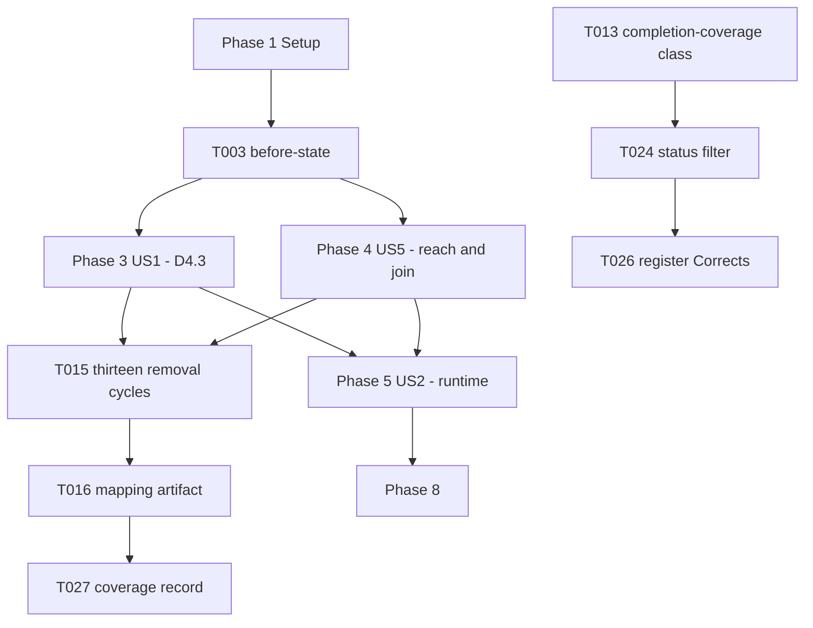

# Tasks: Probe Reachability Correction

**Input**: Design documents from `/specs/042-probe-reachability-correction/`

**Prerequisites**: [plan.md](plan.md), [spec.md](spec.md), [research.md](research.md), [data-model.md](data-model.md), [contracts/probe-mode.md](contracts/probe-mode.md)

**Tests**: This feature *is* test code. Every task below edits or measures the check suite, so there
is no separate test phase — the verification tasks are the deliverable.

**Organization**: Grouped by user story. US1 and US5 are both P1; US5 is the general defect and US1
the instance, so US1 ships first as the MVP and US5 completes the correction.

## Format: `[ID] [P?] [Story] Description`

- **[P]**: Can run in parallel (different files, no dependencies)
- **[Story]**: US1–US5, mapping to spec.md
- Paths are repository-relative from `/Users/…/highway-skills`

## Path Conventions

Shell toolchain, no application code. Work is confined to `.highway/tools/tests/`,
`.specify/memory/completion-register.md`, `specs/041-auto-check-integrity/coverage.md`,
`governance-plan.md`, and this feature's own directory.

**Standing constraints for every task** (plan.md, Technical Context):

- Bash 3.2.57 syntax only; no `git` for restoration; every created file named with `$$`; restore via
  `trap ... EXIT`.
- No literal `specs/` or `.specify/` token in `.highway/tools/tests/` — assemble at runtime, per
  research R7.
- No constitution edit (FR-015). No file under `specs/041-auto-check-integrity/` edited except
  `coverage.md` (D5.1).

---

## Phase 1: Setup (Baseline)

**Purpose**: Establish the "before" state, because several success criteria are stated as a change
from a measured figure rather than as an absolute.

- [X] T001 Run `bash .highway/tools/tests/run-all.sh` and confirm exit 0 before the first edit, recording the output, per FR-016
- [X] T002 [P] Time five or more consecutive suite runs and record the range in `specs/042-probe-reachability-correction/research.md` under R5 as the pre-change baseline, per SC-005

---

## Phase 2: Foundational (Blocking Prerequisites)

**Purpose**: Prove the four rules are unreached *before* changing anything. After the fix this
measurement is unrepeatable, and SC-002 is stated as a fall from four to zero.

**⚠️ CRITICAL**: T003 must complete before any test file is edited.

- [X] T003 For each of `D4.3`, `D5.5`, `D7.2`, `D7.4`, remove that rule's enforcement from the tree, run only that rule's test in probe mode for every declared class, confirm every leg still exits non-zero, restore byte-exact, and record the four results in `specs/042-probe-reachability-correction/research.md` under R1 as the measured before-state, per FR-024 and SC-002

**Checkpoint**: The four unreached rules are evidenced by observation, not by source reading.

---

## Phase 3: User Story 1 - `D4.3` is provable (Priority: P1) 🎯 MVP

**Goal**: A declared artifact class on `distribution-packaging.test.sh` reaches both refusal paths
`D4.3`'s Enforcement Map note promises, and the modified-file refusal becomes asserted at all.

**Independent Test**: Remove either refusal from `generate-distribution.sh`; the suite fails and
names which. Restore; the suite passes.

- [X] T004 [US1] Add `generated-artifact` to the `# Artifact classes:` header comment at line 13 and to the runtime class validation in `.highway/tools/tests/distribution-packaging.test.sh`, keeping the two in agreement and leaving the undeclared-class exit 2 path unchanged, per FR-001 and FR-006
- [X] T005 [US1] Add a single refusal assertion helper in `.highway/tools/tests/distribution-packaging.test.sh` that captures the generator's output rather than discarding it to `/dev/null` and requires the refusal message to name the offending path, per FR-003 and FR-018
- [X] T006 [US1] Rewrite the existing untracked-directory guard at lines 193–204 of `.highway/tools/tests/distribution-packaging.test.sh` to call the T005 helper instead of `>/dev/null 2>&1`, and fix its use of `$WORK`, which is uninitialised when the file is invoked in probe mode, per FR-004
- [X] T007 [US1] Add a normal-mode assertion in `.highway/tools/tests/distribution-packaging.test.sh` that builds a target, modifies a recorded file inside it, and requires `generate-distribution.sh` line 76's refusal naming that file — a path asserted in no mode today, per FR-017 and research R2
- [X] T008 [US1] Add the `generated-artifact` probe branch to the probe block at lines 39–81 of `.highway/tools/tests/distribution-packaging.test.sh`: one build serving both refusals, seeding an untracked directory and a modified file, deciding both through the T005 helper, with `$$`-named artifacts and `trap` restoration, per FR-002, FR-005 and FR-019
- [X] T009 [US1] Verify all four exit conditions for the new class in `.highway/tools/tests/distribution-packaging.test.sh` — `--probe generated-artifact` non-zero, `--neutralise` zero, an undeclared class exit 2, no arguments unchanged — and record the observed codes, per SC-003
- [X] T010 [US1] Remove each of the three parts of `D4.3`'s note in turn from `.highway/tools/generate-distribution.sh` — untracked-directory refusal, modified-file refusal, and the path naming in each message — confirm the suite fails for each, and restore byte-exact after each, per SC-001 and SC-008
- [X] T011 [US1] Confirm no probe artifact remains under the repository after a passing run and after a deliberately failed run of `.highway/tools/tests/distribution-packaging.test.sh`, per SC-004

**Checkpoint**: `D4.3` is provable and its modified-file half is defended. The MVP is shippable here.

---

## Phase 4: User Story 5 - Every mapped rule is reached (Priority: P1)

**Goal**: `spec-record` reaches `D5.5`, `completion-coverage` reaches `coverage_check`, and the
class-to-rule join is recorded as measured evidence rather than left implicit.

**Independent Test**: For each of the thirteen `[auto]` rows, remove that rule's enforcement and
confirm the suite fails, naming the leg that detected it.

- [X] T012 [P] [US5] Broaden the `disposable-fixture` probe in `.highway/tools/tests/spec-record.test.sh` to seed an identity defect alongside the existing numbering gap — writing a `spec.md` carrying a mismatched `Feature Branch` value into the probe tree so `identity_problems` has something to read — and require detection of both, so the leg fails if either enforcement is removed, per FR-021 and contract clauses C4 and C5
- [X] T013 [P] [US5] Add `disposable-fixture` to the `# Artifact classes:` declaration and runtime validation in `.highway/tools/tests/completion-coverage.test.sh`, with a probe leg that seeds a defect into the checked-in fixture at `$FIXTURES/coverage-valid` and decides it through `coverage_check`, restoring byte-exact, per FR-022 and research R4
- [X] T014 [US5] Run `bash .highway/tools/tests/constitution-inventory.test.sh` and confirm it executes the two new classes as part of deciding `D3.7` with no change to how it decides any existing class, per FR-007
- [X] T015 [US5] For each of the thirteen `[auto]` Enforcement Map rows, remove that rule's enforcement, run the suite, record whether it failed and which leg reported it, then restore byte-exact — thirteen remove-run-restore cycles, derived by observation and not by reading probe source, per FR-024 and plan measurement M4
- [X] T016 [US5] Write the mapping from T015 to `specs/042-probe-reachability-correction/contracts/rule-probe-map.md` in the shape data-model.md section 3 specifies — rule, test, class, enforcement removed, suite failed, detecting leg — with thirteen rows and no rule unaccounted for, per FR-023 and SC-009
- [X] T017 [US5] Confirm the count of rules not reached by any declared probe has fallen from the four recorded in T003 to zero, and record the confirmation in `specs/042-probe-reachability-correction/contracts/rule-probe-map.md`, per SC-002

> **T017 is satisfied, but not as SC-002 worded it.** T015's exhaustive pass found three further
> unreached rules the Feature 041 audit had missed — `D4.5`, `D4.6` and `D3.7`. The owner elected to
> correct all three inside this feature (T032–T035 below). The measured fall is therefore from
> **seven** to zero, not from four to zero: four was the sample T003 measured, never the population.
> `SC-002`'s wording is corrected in spec.md.

---

## Phase 4b: User Story 5 continued — the three rules T015 uncovered (Priority: P1)

**Goal**: The three rules found unreached by the first exhaustive pass are reached, by the same
standard applied to the original four.

- [X] T032 [US5] Extract `adapter-coverage.test.sh`'s four inline `D4.6` orphan loops into `orphan_problems()` called by normal mode, so a probe can decide them through the same code normal mode does
- [X] T033 [US5] Rewrite `adapter-coverage.test.sh`'s `generated-artifact` leg to seed each of eight `D4.5`/`D4.6` defects separately and require each to be reported, replacing the four-at-once seeding that let any single check be deleted with the leg still failing, per contract clause C5
- [X] T034 [US5] Seed all three of `harness_probe_pair`'s reports in `constitution-inventory.test.sh`'s probe leg, and assert all three in normal mode against the same function — asserting the **message**, not only the return code — because the `seeded_exit` branch carries D3.7's own verdict and cannot be proved through the probe channel
- [X] T035 [US5] Re-run all thirteen removal cycles and confirm thirteen of thirteen now fail the suite, recording the result in `contracts/rule-probe-map.md`

**Checkpoint**: `D3.7`'s report that every mapped check was proved now means every mapped rule was
proved.

---

## Phase 5: User Story 2 - The runtime claim matches the measurement (Priority: P2)

**Goal**: The superseding contract states a measured range and a measured added cost, retains 180s
as knowingly unmet, and sets the 240s interim ceiling.

**Independent Test**: Every figure in the contract's Runtime section can be reproduced by re-running
the command recorded beside it.

**Dependency**: Cannot start until T008, T012 and T013 are complete — FR-009 requires measurement
after every added class is in place, explicitly not scaled from the `D4.3` class.

- [X] T018 [US2] Measure each probe leg this feature adds or broadens separately — the `generated-artifact` legs of `.highway/tools/tests/distribution-packaging.test.sh`, the `disposable-fixture` legs of `.highway/tools/tests/completion-coverage.test.sh`, and the delta on the broadened leg of `.highway/tools/tests/spec-record.test.sh` — and record each figure in `specs/042-probe-reachability-correction/research.md` under R5, per FR-009 and plan measurements M1 and M2
- [X] T019 [US2] Time five or more consecutive runs of `bash .highway/tools/tests/run-all.sh` with all classes in place and record the range, confirming every run falls under 240 seconds, per SC-005, FR-020 and plan measurement M3
- [X] T020 [US2] Replace the measured figures in the Runtime section of `specs/042-probe-reachability-correction/contracts/probe-mode.md` with the T018 and T019 results, keeping 180 seconds as the target recorded as knowingly unmet and naming governance plan Phase 14, per FR-009, FR-010 and FR-020
- [X] T021 [US2] Update the Phase 14 cost paragraph in `governance-plan.md` with the measured total, replacing the open figure currently recorded there, as an appended correction rather than a silent rewrite

**Checkpoint**: No runtime figure in the repository is an estimate.

---

## Phase 6: User Story 3 - The coverage record states the counted figure (Priority: P3)

**Goal**: Feature 041's `coverage.md` says thirteen rows across eight files.

**Independent Test**: Count `[auto]` rows in the Enforcement Map and unique test filenames they
name; the record agrees.

- [X] T022 [P] [US3] Change "all twelve Enforcement-Map-mapped checks" to the counted figure of thirteen rows across eight unique test files under `FR-010` at line 14 of `specs/041-auto-check-integrity/coverage.md`, changing no other row, per FR-011 and the D5.1 exception
- [X] T023 [US3] Count the `[auto]` rows and unique test files in the Enforcement Map at `.specify/memory/constitution.md` lines 289–303, confirm the corrected record agrees, and confirm `bash .highway/tools/tests/completion-coverage.test.sh` still exits 0, per SC-006

---

## Phase 7: User Story 4 - Declaring a correction does not require finishing it (Priority: P3)

**Goal**: The `D7.5` corrective set is scoped to `complete` register entries, so this feature can
name what it corrects while in progress.

**Independent Test**: An `in-progress` entry with a `Corrects` value passes; a `complete` entry with
one and no provenance still fails.

**Dependency**: T024 edits `.highway/tools/tests/completion-coverage.test.sh`, which T013 also edits
— these two tasks are sequential, not parallel.

- [X] T024 [US4] Add a `status` filter to the `register_rows` loop at line 540 of `.highway/tools/tests/completion-coverage.test.sh`, which today filters only on `corrects`, so `correction_check` evaluates `complete` entries only, per FR-013
- [X] T025 [US4] Assert both directions in `.highway/tools/tests/completion-coverage.test.sh`: an `in-progress` entry declaring a corrected feature passes, and a `complete` entry declaring one without corrective provenance still fails and names the feature, per SC-007 and D3.4
- [X] T026 [US4] Replace the `-` placeholder with `041-auto-check-integrity` in this feature's `Corrects` column in `.specify/memory/completion-register.md`, removing the workaround recorded in the spec's Assumptions, per FR-014

**Checkpoint**: The register states the correction at the moment the intent was formed.

---

## Phase 8: Polish & Cross-Cutting Concerns

- [X] T027 Write `specs/042-probe-reachability-correction/coverage.md` naming Feature 041 as the originating feature for each corrected requirement, with evidence drawn from the measurements recorded in T015, T018 and T019 rather than from "the suite is green", per FR-012 and D7.5
  > Written with all 27 FR rows `satisfied`. `D7.5` as implemented requires a corrective record to
  > hold a `deferred` row carrying the provenance string, and this feature defers nothing. Measured:
  > with 042's register row set to `complete`, the suite exits 1 with
  > `FAIL: corrective record has no deferred rows`. No deferred row was invented to silence it; the
  > tension is recorded at the foot of the coverage record for whoever marks the row complete.
- [X] T028 [P] Confirm `.specify/memory/constitution.md` is byte-identical to its pre-feature state — no rule added, no rule text, Observable or tier amended — per FR-015
- [X] T029 [P] Confirm no file under `specs/041-auto-check-integrity/` other than `coverage.md` differs from its pre-feature state, per D5.1
- [X] T030 [P] Confirm no assertion Feature 041 added has been removed or loosened, by reviewing each changed hunk in the three edited test files against its prior form, per FR-015
  > One assertion **was** deliberately narrowed, and it should not be reported as "nothing loosened".
  > `correction_check`'s corrective set now skips register rows whose status is not `complete`, so a
  > declaration made before a feature finishes is no longer evaluated. That is the loosening FR-013
  > asks for, and it is what made FR-014's honest declaration possible. Every other change adds:
  > the adapter-coverage leg went from one union of four defects to eight seeded singly, the
  > constitution-inventory leg from one case to three plus three normal-mode message assertions, and
  > the spec-record and completion-coverage legs each gained a second required enforcement.
- [X] T031 Run `bash .highway/tools/tests/run-all.sh` and confirm exit 0 after the last edit, per FR-016
  > Measured: exit 0, 202.7s, 139 PASS lines. Exit 0 is necessary and not sufficient — the suite was
  > green throughout Feature 041 while seven of thirteen rules were reached by no probe leg at all.

---

## Dependencies



**Story completion order**: US1 → US5 → US4 → US3 → US2 → Polish.

US2 is P2 but sequenced last among the stories because FR-009 forbids measuring before every class
exists. Priority here orders *importance*, not execution.

**Hard sequencing constraints**:

- T003 before every edit. Its measurement becomes unavailable afterwards.
- T015 after T008, T012 and T013. Measuring reach before the reach exists proves nothing.
- T018 and T019 after all three test files are final.
- T013 before T024 — same file.
- T026 after T024 — the register entry is what T024 makes legal.

---

## Parallel Execution Examples

**Phase 4, at the start**: T012 and T013 touch different files and share no state.

```sh
bash .highway/tools/tests/spec-record.test.sh          # T012's file
bash .highway/tools/tests/completion-coverage.test.sh  # T013's file
```

**Phase 8**: T028, T029 and T030 are three independent read-only comparisons.

**Not parallel, despite appearances**: T010 and T015 both remove enforcement from the tree and run
the suite. Running them concurrently means two processes mutating the same working tree, and each
would observe the other's seeded defect. Run them one at a time.

---

## Implementation Strategy

**MVP**: Phase 1 → Phase 2 → Phase 3. That closes the one genuine hole — `D4.3`'s modified-file
refusal, asserted in no mode today — and makes `D4.3` provable. It is independently shippable.

**Increment 2**: Phase 4. Converts the fix from an instance into the general correction, and
produces the mapping artifact that is the only evidence distinguishing this feature from the one it
corrects.

**Increment 3**: Phases 5–7. Honest runtime figures, the corrected count, and the register fix.

**Cost warning**: T015 is thirteen remove-run-restore cycles against a suite measured at 175–206
seconds, so it dominates the feature's elapsed time. There is no cheaper substitute that still
satisfies FR-024 — reading probe source is exactly what produced the report being corrected.

**Done does not mean green.** T031's exit 0 is necessary and not sufficient; the suite was green
throughout Feature 041 while four rules went unproved.
