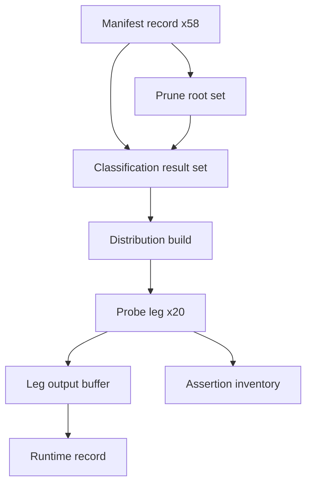

# Phase 1 Data Model: Test Suite Runtime Recovery

**Feature**: 056-test-suite-runtime-recovery | **Date**: 2026-09-20

No database and no persisted schema. The entities below are the structures this feature's shell
code builds in memory or in scratch files, plus the two records it writes to disk. They are stated
here because their invariants are what the equivalence proofs check.

---

## 1. Manifest record

The 58 lines of `.highway/tools/.distribution-manifest`, already the single declaration of the
distributed path set (D1.6).

| Field | Type | Notes |
|---|---|---|
| `classification` | `include` \| `exclude` | Column 1 |
| `source` | repository-relative path | Column 2 |
| `destination` | path or `-` | Column 3; `-` means "lands unchanged" |

**Invariants**
- Comment and blank lines are not records.
- A record covers its own path and everything beneath it.
- Longest matching `source` prefix wins. This is what lets an `include` sit beneath an `exclude`.
- A path matching no record is `unclassified`, which is a failure and never a default.

**Unchanged by this feature.** The file is not edited. Only how often it is read changes.

## 2. Prune root

Derived, never stored. A manifest record qualifies when:

- its `classification` is `exclude`, **and**
- no other record's `source` is strictly beneath it.

**Today's set**: `specs`, `.specify`, `.gitignore`, `README.md`, `governance-plan.md`,
`nfr-plan.md`, `.DS_Store`, `.highway/tools/tests`, and the individual excluded files under
`.highway/tools/`. Of these only `specs` and `.specify` are directories large enough to matter —
`specs` alone is 501 of 773 files.

**Non-members, and why this set must be derived**: `.claude`, `.cursor`, `.github` and `.highway`
are all `exclude` records *with includes beneath them*. Pruning any of them would drop the adapter
trees and the entire shipped skill set out of the distribution. A hardcoded prune list is therefore
a latent packaging defect, and FR-019's standing check exists to catch a regression that
reintroduces one.

**Invariant (FR-008)**: for every path `p` in the repository, `classify(p)` after pruning equals
`classify(p)` before pruning, or `p` is beneath a prune root and is `exclude` by both routes.

## 3. Classification result set

The output of `dist_classify_many`: one `classification<TAB>path` line per input path.

**Invariants**
- One line out per line in, in input order.
- Each line's `classification` is byte-identical to what `dist_classify` returns for that path
  alone. This is the whole of the equivalence proof in
  [contracts/classification-equivalence.md](contracts/classification-equivalence.md).
- `dist_classify` survives as a wrapper, so every existing caller keeps working unchanged.

## 4. Distribution build

One complete production and verification of the user-facing tree. The suite's dominant unit of
cost at 9.6s.

| Property | Value |
|---|---|
| Inputs | Repository tree, manifest, target directory |
| Outputs | 83 files, a recorded generation timestamp, exit code |
| Freshness | `fresh` or `reused` |

**State transitions**: a build is produced once per `(test process, freshness requirement)` pair.
A build marked `reused` is read by several assertions and mutated by none.

**Invariant (FR-009, SC-006)**: the bytes of a reused build equal the bytes of a fresh one, aside
from the recorded generation timestamp the D4.2 Observable already excepts. An assertion that
mutates the tree must declare `fresh` and gets its own build.

## 5. Probe leg

One `(test file, artifact class, seeded | neutralised)` execution. Twenty exist.

| Field | Type |
|---|---|
| `rule_id` | Enforcement Map rule, e.g. `D4.2` |
| `test_name` | e.g. `generate-catalog.test.sh` |
| `class` | `source-document` \| `generated-artifact` \| `disposable-fixture` |
| `mode` | `seeded` \| `neutralised` |
| `serial_group` | `none`, or a group name |
| `expected_exit` | non-zero (seeded), zero (neutralised), 2 (undeclared class) |

**Invariants**
- A test mapped by more than one rule is probed once, not once per row. Unchanged from today.
- Legs sharing a `serial_group` never overlap. One group exists today: the
  `generate-catalog.test.sh` source file, mutated in place by `constitution-inventory`'s own leg
  and read by `generate-catalog`'s own leg (research D5).
- A leg's exit code is its entire result. Its output is diagnostic and is replayed, not parsed.

## 6. Leg output buffer

One scratch file per leg, named with `$$` and the leg index so the `run-all.sh` sweep pattern
still matches it.

**Invariants (FR-011, SC-009)**
- Replayed in Enforcement Map order, not completion order.
- Replayed whole; no interleaving at any granularity.
- Removed on exit via `trap`, on both the pass and fail paths.
- The concatenation of all buffers, replayed in order, is byte-identical to today's serial output.

## 7. Runtime record

The runtime section of the superseding probe-mode contract.

| Field | Source |
|---|---|
| Range (min–max) | Five consecutive whole-suite runs |
| Median | The same five |
| Core count | `getconf _NPROCESSORS_ONLN` on the measuring machine |
| Effective worker count | The pool size those runs used |
| Target status | `met` or `retained and unmet` |
| Interim ceiling | `removed` (target met) or `retained` (FR-020) |

**Invariant (FR-003, FR-020)**: the record never states a best sample, and never states a target
amended to match an achieved number.

## 8. Assertion inventory

Written once, before any code changes, to
[contracts/assertion-inventory.md](contracts/assertion-inventory.md).

| Field | Meaning |
|---|---|
| `test_file` | The file the assertion lives in |
| `assertion_id` | Stable label for this feature's use |
| `decides` | What the assertion decides, in one sentence |
| `failure_message` | The exact text emitted on failure |
| `after` | `unchanged`, or a note naming the behavior it still proves |

**Invariant (FR-006, D3.5)**: every row exists after the change. A row may move file or change
mechanism; no row may disappear, and none may have its `failure_message` altered without a recorded
reason naming the superseded behavior.

---

## Entity relationships

The chain is the reason phase order in `plan.md` is not negotiable: prune roots are wrong if
manifest semantics are misread, every build is wrong if classification is wrong, every leg is wrong
if builds are wrong, and the runtime record is a fiction if any of them is.
