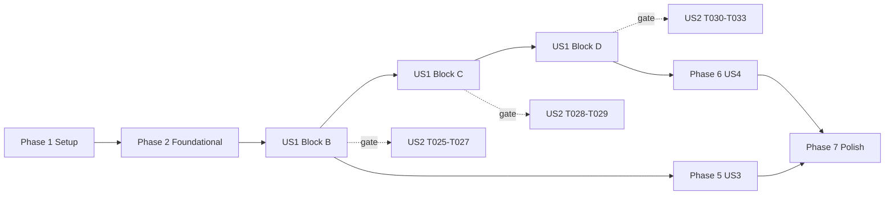

# Tasks: Test Suite Runtime Recovery

**Input**: Design documents from `/specs/056-test-suite-runtime-recovery/`
**Prerequisites**: plan.md, spec.md, research.md, data-model.md, contracts/, quickstart.md

**Tests**: This feature's deliverable *is* test infrastructure. "Test tasks" here mean the
equivalence proofs and guards the contracts require, not new unit tests for application code.

**Organization**: By user story. US1 and US2 are both P1 and are deliberately interleaved —
US2's checks gate each of US1's three optimisation blocks rather than running once at the end.

---

## Phase 1: Setup

**Purpose**: Establish the conditions under which every later measurement is meaningful.

- [X] T001 Confirm the suite is green before any edit: run `bash .highway/tools/tests/run-all.sh` and record the exit code in `specs/056-test-suite-runtime-recovery/research.md`. If it is non-zero, stop — D3.1 makes a baseline on a red tree worthless.
- [X] T002 [P] Record the measuring machine in `specs/056-test-suite-runtime-recovery/research.md`: OS, `/bin/bash --version`, `getconf _NPROCESSORS_ONLN`. Confirm the core count is a positive integer.
- [X] T003 [P] Confirm the working tree is clean of probe residue with `git status --short`, so nothing in the baseline is an artifact of an earlier interrupted run.

---

## Phase 2: Foundational (blocking — Phase A of plan.md)

**Purpose**: Capture the evidence that cannot be reconstructed afterwards. FR-001 makes this
ordering mandatory. **No file under `.highway/tools/` may be edited until Phase 2 is complete.**

- [X] T004 Capture the pre-change suite output with durations masked into `specs/056-test-suite-runtime-recovery/.before.txt`, per quickstart.md §A2. Every later masked diff compares against this file.
- [X] T005 [P] Take five consecutive whole-suite wall-clock runs per quickstart.md §A1 and record min, max and median in `specs/056-test-suite-runtime-recovery/research.md` alongside the core count and worker count (which is 1 at baseline).
- [X] T006 [P] Run all twenty probe legs individually per quickstart.md §A3 and confirm each returns its contract exit code. Any deviation is a pre-existing defect — report it and stop rather than recording it as a timing result.
- [X] T007 Enumerate every assertion in `.highway/tools/tests/constitution-inventory.test.sh` into the table in `specs/056-test-suite-runtime-recovery/contracts/assertion-inventory.md`, with exact failure message text.
- [X] T008 [P] Enumerate every assertion in `.highway/tools/tests/distribution-packaging.test.sh` and `.highway/tools/tests/shipped-tree-independence.test.sh` into the same table.
- [X] T009 [P] Enumerate every assertion in `.highway/tools/tests/adapter-coverage.test.sh` into the same table, then confirm all four in-scope files are represented.

**Checkpoint**: The assertion inventory table is populated and `.before.txt` exists. Only now may
implementation begin.

---

## Phase 3: User Story 1 — Run the suite inside the budget (P1)

**Goal**: Full suite ≤180s across five consecutive runs, all exiting 0.

**Independent test**: `bash .highway/tools/tests/run-all.sh` completes within 180s, five times,
exit 0 each time.

### Block B — Classification (plan.md Phase B, expected −25s)

- [X] T010 [US1] Add `dist_prune_roots` to `.highway/tools/lib/distribution.sh`: emit each `exclude` record having no other manifest record strictly beneath it. Derive from the manifest at runtime — a hardcoded list would drop the adapter trees the first time one moved.
- [X] T011 [US1] Add `dist_classify_many` to `.highway/tools/lib/distribution.sh`: read paths on stdin, load the manifest once, emit `<classification><TAB><path>` in input order using a single `awk` process.
- [X] T012 [US1] Reduce `dist_classify` in `.highway/tools/lib/distribution.sh` to a single-path wrapper over `dist_classify_many` so every existing caller keeps working unchanged.
- [X] T013 [US1] Replace the per-file classification loop in `.highway/tools/generate-distribution.sh` with one `dist_classify_many` call, and add `-prune` predicates to its `find` walk from `dist_prune_roots`.
- [X] T014 [US1] Apply the same pruned walk to `scan_targets` in `.highway/tools/tests/shipped-tree-independence.test.sh`.

### Block C — Build cost (plan.md Phase C, expected −50s)

- [X] T015 [US1] ~~Batch `verify_self_validation` in `.highway/tools/generate-distribution.sh` into a single `validate-skill.sh` invocation across all ten skills~~ **Attempted, measured, reverted.** Implemented with byte-identical single-argument output on both streams and batched output equal to the concatenation of ten single runs. Saved nothing: 9.71s vs 9.63s over three reps of ten skills. Per-skill cost is inside the rule-check and lexicon libraries (108 `awk` spawns per skill), not in process startup, which is all batching removes. Reverted rather than shipped — see research.md §M6.
- [X] T016 [US1] Collapse the per-file `sha256_of` loop in `.highway/tools/generate-distribution.sh` into a single hashing pass over the 83 distributed files. **Done.** Record byte-identical, produced tree byte-identical across all 83 files, produce log identical. Build 5s → 4s.
- [X] T017 [US1] ~~Share the existing `dist` build across the read-only assertions~~ **Examined; nothing to change, and that is the result.** All eleven builds were reviewed: six in normal mode, five in probe mode. One is the shared build, one is the second half of DP-10's pair, four each seed a different repository state. DP-18 already reuses the shared build (the reuse and its reason are commented in place at that assertion). No further reuse exists that does not weaken an assertion, which FR-006 and inventory rule R4 forbid. Build count unchanged at eleven; recorded in the assertion inventory.
- [X] T018 [US1] Confirm the tree-copy situation in `.highway/tools/tests/adapter-coverage.test.sh`. **Confirmed, no reuse available.** Normal mode makes exactly one `CURRENCY_TMP` copy and AC-15 already shares it. The only other copy is in probe mode, where AC-13 perturbs a skill source and therefore cannot share it. Recorded in the assertion inventory rather than manufactured.

### Block D — Concurrency — ~~DESCOPED 2026-09-20, deferred to `governance-plan.md` Phase 16~~

**Not implemented, and not withdrawn.** The design stands; the trade did not. Block B cut these
legs from 111.75s to ~55s, so the expected saving fell from −85s to ~32s, and the serialization set
recorded in `research.md` D5 was verified wrong on 2026-09-20 — at least four legs contend over
`.highway/catalog/index.*` and `.highway/tools/.adapter-manifest`, not the one pair D5 names.
Separately, ~6s of suite time per added skill (Phase 15) covers roughly 60% of the same work, so
doing concurrency first would pay full cost for a saving Phase 15 then erodes to ~15–22s. See
spec.md FR-010, FR-021 and SC-011, all recorded as not met.

- [ ] ~~T019 [US1] Add worker-count resolution to `.highway/tools/tests/constitution-inventory.test.sh` per contracts/suite-execution.md: `HIGHWAY_TEST_WORKERS` if set, else `getconf _NPROCESSORS_ONLN`, else 1. A non-positive-integer override is an error naming the variable and the value, never a silent fallback.~~ **Deferred to Phase 16.** The `getconf` Declared Toolchain amendment this required was reverted; `.specify/memory/constitution.md` is back at 2.0.0.
- [ ] ~~T020 [US1] Restructure `harness_run` in `.highway/tools/tests/constitution-inventory.test.sh` to emit its leg list to a dispatch file and execute it through `xargs -P <workers>`, each leg writing to its own `$$`-named scratch file. Bash 3.2 form only — no `wait -n`, no associative arrays.~~ **Deferred to Phase 16.**
- [ ] ~~T021 [US1] Replay leg buffers in Enforcement Map order in `.highway/tools/tests/constitution-inventory.test.sh`, each buffer whole, and remove them via `trap ... EXIT` on both the pass and fail paths.~~ **Deferred to Phase 16.**
- [ ] ~~T022 [US1] Declare the `generate-catalog-source` serialization group in `.highway/tools/tests/constitution-inventory.test.sh` so its own `source-document` leg never overlaps `generate-catalog.test.sh`'s `generated-artifact` leg, which read and mutate the same file.~~ **Deferred to Phase 16, and its premise corrected** — this group is necessary but not sufficient.
- [ ] ~~T023 [US1] Confirm `HIGHWAY_TEST_WORKERS=1` runs every leg sequentially through the same code path, so serial mode is a pool size rather than a second implementation (FR-021).~~ **Deferred to Phase 16.**
- [X] T024 [US1] Take five consecutive whole-suite runs and record range, median and core count in `specs/056-test-suite-runtime-recovery/research.md`. **Retained** — FR-002 requires it regardless of Block D. The effective worker count is 1 and is recorded as such. **Done 2026-09-20: 171/174/185/287/170s, range 170–287s, median 174s, all exit 0. SC-001 NOT met — see research.md §M7; FR-020 applies.**

**Checkpoint**: The suite runs inside 180s, or FR-020 applies and the achieved range is recorded
without amending the target. **Outcome: FR-020 applies.** 170–287s over five runs, median 174s.
Three runs inside the target, two outside it. The target is unchanged at 180s.

---

## Phase 4: User Story 2 — Keep every probe proving what it proves (P1)

**Goal**: No class dropped, no assertion removed or loosened, no output reordered.

**Independent test**: all twenty legs return their contract exit codes; the masked output diff
against `.before.txt` is empty; every assertion inventory row has a non-empty `after`.

**These tasks are gates, not a final sweep.** Run T025–T027 after Block B, T028–T029 after Block C,
and T030–T032 after Block D. A failure here stops the block that caused it.

- [X] T025 [US2] Prove per-path classification equivalence over all 773 repository paths per contracts/classification-equivalence.md O1, and keep the old path in place until the diff is empty.
- [X] T026 [US2] [P] Prove the eight adversarial paths in contracts/classification-equivalence.md O1 classify correctly, especially the includes beneath `exclude .github` and `exclude .highway`.
- [X] T027 [US2] [P] Assert `dist_prune_roots` output contains no root with a manifest record beneath it, and specifically excludes `.github`, `.claude`, `.cursor` and `.highway` (contracts/classification-equivalence.md O2).
- [X] T028 [US2] Prove the produced distribution is byte-identical to the pre-change tree for all 83 files, aside from the recorded generation timestamp, per contracts/classification-equivalence.md O4 and quickstart.md Phase C.
- [X] T029 [US2] [P] ~~Prove batched `verify_self_validation` emits identical output and exit code for the all-pass case and for each of the ten single-skill-failure cases.~~ **Proven, then made moot.** The equivalence held on every case. T015 was reverted anyway because it saved nothing, so there is no batched path left for this gate to guard. Kept marked done because the proof was genuinely performed; it now guards nothing.
- [X] T030 [US2] Re-run all twenty probe legs individually and confirm every contract exit code is unchanged from T006 (SC-003, SC-004). **Done: twenty legs, zero violations, 56s total.**
- [X] T031 [US2] Diff the suite's masked output against `specs/056-test-suite-runtime-recovery/.before.txt` and confirm it is empty (SC-009). **Done, in two parts.** Before the new test existed the diff was **empty**. After adding `classification-scope.test.sh` the diff is exactly the new test's own eight output lines plus `40 passed` → `41 passed`, and nothing else — an addition, not a drift. `.before.txt` was deliberately not regenerated. Run order confirmed stable across three runs including one with seeded failures. See research.md §M9.
- [ ] ~~T032 [US2] [P] Diff a `HIGHWAY_TEST_WORKERS=1` run against a default concurrent run and confirm identical exit code and identical masked output (SC-011).~~ **Deferred to Phase 16** — no concurrent run exists to diff against.
- [X] T033 [US2] Fill the `after` column for every row in `specs/056-test-suite-runtime-recovery/contracts/assertion-inventory.md`. **Done: 73 rows, none empty, no counterpart missing, no `after` recording a weakened conclusion.** T017 and T018 introduced no new shared builds, which is recorded as the finding rather than as an omission. Three assertions were *added* (CS-01..CS-03) and are listed separately.

---

## Phase 5: User Story 3 — Stop the suite growing with the specification history (P2)

**Goal**: Adding feature specs stops adding permanent suite runtime.

**Independent test**: 500 files added beneath `specs/` change total runtime by ≤5s, and the
standing guard fails when a per-file pass over an excluded location is reintroduced.

- [X] T034 [US3] Create `.highway/tools/tests/classification-scope.test.sh` asserting that no classification pass enumerates a path beneath a prune root. Structural only — it MUST NOT depend on wall-clock measurement (FR-019). **Done: three assertions, no timing dependency.**
- [X] T035 [US3] Declare `# Instrument class:` and `# Artifact classes:` headers in `.highway/tools/tests/classification-scope.test.sh`. **Done** — `static-document-contract` / `source-document`, plus a seeded-failure-probe line. Accepted by `constitution-inventory.test.sh` on first run.
- [X] T036 [US3] Record the expected verdict for every existing path before enabling the new check, per D3.4. **Done: 4 PASS lines, exit 0, 13 prunable roots, 0s elapsed.**
- [X] T037 [US3] Seed a per-file pass over an excluded location, confirm the test fails and names the offending path and prune root, then restore. **Done.** With `dist_prune_roots` renamed out of `generate-distribution.sh`, the test exited **1**, named that file, and listed the roots that would then go unpruned. Restored and confirmed byte-identical.
- [X] T038 [US3] Add `.highway/tools/tests/classification-scope.test.sh` to the suite and confirm its cost is under one second. **Done** — `run-all.sh` discovers it by glob, no registration edit needed. Suite reports **41 passed, 0 failed**; the test runs in under 1s.
- [X] T039 [US3] Run the +500-file growth experiment per quickstart.md §F2, confirm ≤5s against the ~55s baseline, and delete `specs/.growth-probe` afterwards. **Done: +5s, at the bound; probe deleted and `git status` confirmed clean.** The 5s sits inside this machine's ±15s run-to-run spread, so it is reported as *at or below the bound* rather than as a precise figure; the structural guard is the stronger evidence. See research.md §M8.

---

## Phase 6: User Story 4 — Read an honest runtime record (P2)

**Goal**: The shipped contract states what the suite actually costs.

**Independent test**: contracts/probe-mode.md states a measured range, and the ceiling and
deviation are disposed of according to what was measured rather than what was hoped for.

- [X] T040 [US4] Populate the runtime table in `contracts/probe-mode.md` from T024's five runs. **Done: range 170–287s, median 174s, 6 cores, 1 effective worker, against a 231–263s / median 233s baseline.**
- [X] T041 [US4] Set the target status in `contracts/probe-mode.md`. **Done: `retained and unmet`.** Run 3 (185s) and run 4 (287s) exceeded 180s, and run 4 exceeded the 240s ceiling too. The ceiling is **retained**, Feature 042's deviation stays **open**, and the 180s target is **not amended** (FR-020). FR-015 does not fire.
- [X] T042 [US4] [P] Confirm the corrected scope count in `contracts/probe-mode.md`. **Confirmed by execution:** the T030 sweep ran twenty legs across six files covering ten classes, matching the table exactly. Taken from what ran, not from what any file declares (C8).
- [X] T043 [US4] [P] Correct the class count in `governance-plan.md` Phase 14 (FR-016). **Done.** The original "eleven → thirteen classes across eight mapped files" sentence is left in place with a dated correction beneath it: ten classes across six files, twenty legs, nine Map rows. The overcount came from counting declarations in unmapped files and from reusing a row count as a class count.
- [X] T044 [US4] Confirm no Layer 1 or Layer 2 artifact was touched and no constitution *rule* was added or amended (FR-017). **Confirmed.** Only four paths under `.highway/` changed, all of them tooling. Both constitution documents are byte-identical to `HEAD`. ~~The 2.1.0 toolchain-list amendment is recorded in plan.md's resolved gate item.~~ **That amendment was reverted** when Phase D was descoped, so this feature changed no governance document at all and FR-017 is satisfied literally rather than by argument.

---

## Phase 7: Polish & Cross-Cutting Concerns

- [ ] ~~T045 Verify `xargs -P` ordered replay and `getconf _NPROCESSORS_ONLN` on Linux as well as macOS (D2.3, research Q-B). A non-numeric or empty result must fall back to 1 worker, which FR-021 already requires be fully supported.~~ **Deferred to Phase 16** — neither utility is now used. Research Q-B stays open and is carried forward.
- [X] T046 [P] Confirm `run-all.sh` exit codes are unchanged: 0 when all pass, 1 with `Failed tests:` naming each failing file (FR-013, SC-008). **Done with two reachable seeded failures: `Summary: 39 passed, 2 failed`, both named, exit 1.** A first seed appended after the file's own `exit $fail` and was unreachable — recorded in research.md §M10, because a green run from an unreachable seed proves nothing.
- [X] T047 [P] Confirm the residue sweep in `.highway/tools/tests/run-all.sh` still matches the new leg buffers, and that an interrupted run leaves nothing behind (FR-014). **Confirmed, and narrowed:** the `$$`-named leg buffers this task anticipated were a Phase D construct and were never built, so the sweep is unchanged and had nothing new to match. `git status --short` was clean of probe residue after the clean run, the growth run and the failing run.
- [X] T048 [P] Confirm adding a new agent tree or skill requires no change to any file this feature touched (FR-018). **Confirmed by experiment:** one `exclude` record for a simulated `.zeta-agent` tree took the prune roots from 13 to 14, the guard passed and the build succeeded excluding it — with no code edited. See research.md §M10.
- [X] T049 Final gate: `bash .highway/tools/tests/run-all.sh` exits 0, `git status --short` shows no probe residue, and `specs/056-test-suite-runtime-recovery/.before.txt` is deleted. **All three done.** Suite exit 0, `41 passed, 0 failed`. `git status --short` lists only this feature's own four `.highway/` paths, `governance-plan.md` and the spec directory. `.before.txt` removed; its verdict is preserved in research.md §M9, which is the only place it now survives.

---

## Outcome

**Shipped**: Phase B (pruned, batched classification) and the surviving half of Phase C (one
hashing pass), plus one new standing guard. Three files changed, one added.

**Not shipped, and recorded as such**: Phase D concurrency, deferred to `governance-plan.md`
Phase 16 with its design intact. The self-validation batching, implemented and reverted because
it saved nothing. Build and tree-copy reuse, which turned out to be already done or unsafe.

**Result**: median 233s → 174s, range 231–263s → 170–287s. **SC-001 and SC-007 are not met.**
The 180s target is retained unamended, the 240s interim ceiling stays in force, and Feature 042's
runtime deviation stays open. Eight of eleven success criteria met, two failed, one deferred.
No artifact class was dropped, no probe leg weakened, no assertion removed or loosened, and no
constitution rule touched.

---

## Dependencies

**Hard ordering**:

- Phase 2 before any `.highway/tools/` edit. The baseline cannot be taken afterwards.
- T010 → T011 → T012 → T013/T014 (prune roots feed bulk classification feeds both walks).
- T019 → T020 → T021 → T022/T023.
- T034 → T035 → T036 → T037 → T038.
- T024 before T040. T030 before T042.

**Deliberately independent**: Blocks B, C and D each leave the suite green and the masked output
diff clean on their own. If Block D proves unworkable, B and C still ship.

## Parallel opportunities

| Phase | Parallel tasks |
|---|---|
| Setup | T002, T003 |
| Foundational | T005, T006 alongside T007–T009 (different files) |
| US1 | T013 and T014 after T012; T015 and T016 are separate functions; T017 and T018 are separate files |
| US2 | T026, T027 after T025; T029 alongside T028; T032 after T031 |
| US4 | T042, T043 |
| Polish | T046, T047, T048 |

`harness_run` tasks (T019–T023) are all in one file and must not be parallelised.

## Implementation strategy

**MVP**: Phase 1 + Phase 2 + US1 Block B + its US2 gates (T025–T027). That alone removes the
growth coupling and ~25s, and it is independently shippable.

**Increment 2**: Block C + T028–T029. Roughly −50s.

**Increment 3**: Block D + T030–T033. Roughly −85s, and the largest single risk — concurrency in a
Bash 3.2 harness.

**Increment 4**: US3, then US4.

**Stop conditions** (quickstart.md): any leg losing its contract exit code; any assertion with no
counterpart; any distribution file differing beyond the generation timestamp; an unexplained
non-empty masked diff. If reaching 180s appears to require dropping a class or loosening a probe,
stop — governance plan Phase 14 calls that a coverage loss, and FR-020 says what to ship instead.
