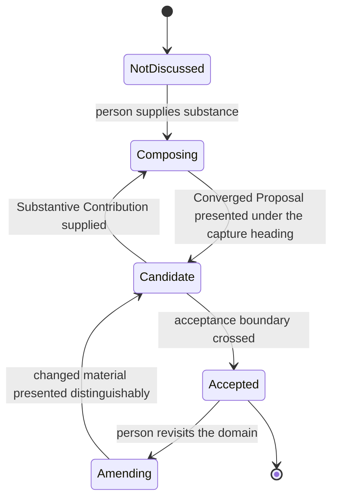

# Data Model: Profile Conversation Conformance

No runtime data structure changes. FR-031 freezes the retained Profile schema and its readiness
dimensions. The entities below are **document structures** and **conversational states** that the
amended text must describe consistently.

---

## Document entities

### Rule row

A single line in the Experience Standard's `## Rules` tables.

| Field | Constraint |
|---|---|
| Identifier | `X<section>.<n>`, matching `^\| X[0-9]+\.[0-9]+ \|`. New rows start at X2.58. Retired IDs (X1.7, X2.2, X2.27, X2.28, X2.33) are never reused. |
| Rule text | Exactly one keyword (P1.1), exactly one obligation (P1.2), at most 25 words (P1.3). |
| Observable | The decision procedure. Where a behavior is not reducible to a literal, FR-005 requires this field to be applicable without self-assessment. |
| Check class | `[auto]` or `[agent-checkable]`. |

**Invariant**: the total row count is asserted at five test sites. Adding rows requires updating all
five in the same change.

### Point-of-use site

A location in a skill document where an obligation applies and the skill states what it emits or
what it does.

| Field | Constraint |
|---|---|
| Host skill | A `.highway/skills/*/SKILL.md`. |
| Section | The specific heading under which the obligation applies. |
| Form | Emitted literal, or skill-owned procedure. Never a restated obligation (P7.3; Research D1). |
| Applicable site count | The number of locations the obligation governs. For the Profile domain literals this is 4. |

**Invariant**: SC-002 requires the realized count to equal the applicable count, and SC-004 requires
removal of any single site to fail the test by name.

### Gate assertion

A bullet in a skill's `## Verification` section.

**Invariant**: every behavior this feature adds or amends has exactly one gate bullet. Profile's
`## Verification` currently holds twelve bullets; one is rewritten (FR-013) and one is relocated into
the domain instructions (FR-028).

### Emitted literal

A string the skill reproduces verbatim in conversation.

| Literal | Sites | Source of truth |
|---|---|---|
| Capture heading | 4 Profile domains | `contracts/profile-wording.md` |
| Validation question | 4 Profile domains | defined once, referenced four times (FR-014) |
| Acceptance request | 4 Profile domains | `contracts/profile-wording.md` |
| Domain opening headings | 3 of 4 domains (Identity has none) | unchanged by this feature |

**Invariant**: superseded strings are removed outright, not deprecated (FR-030). A superseded string
must appear nowhere in the repository after the change, which the test asserts with `require_absent`.

---

## Conversational states

These describe the behavior the amended text governs. They are **not** persisted, and no readiness
dimension is derived from them.

### Domain lifecycle

**Transition rules**:

| Transition | Governing requirement |
|---|---|
| Composing → Candidate | At least one acceptance boundary per domain (FR-006, revised in clarification from "exactly one"). |
| Candidate → Accepted | Acceptance recognized by meaning, not by matching a phrase. Agreement with a Working Idea is not acceptance; a request for information is not acceptance. |
| Accepted → Candidate (suppressed) | Confirmed substance is not re-presented. Identity is tested **whitespace-normalized**, per clarification Q4. |
| Amending → Candidate | Accepted text preserved unchanged; the change presented distinguishably; the original **form** preserved too (new rule, Research D3). |

**Re-arming**: a revisit after acceptance legitimately produces a second boundary for the same
domain. This is why FR-006 says "at least one" and the ceiling rule, not a count, prevents repeats.

### Acceptance boundary

| Property | Value |
|---|---|
| Floor | A domain is not retained until a boundary is crossed. |
| Ceiling | Confirmed substance is not presented for review again. |
| Identity test | Whitespace-normalized equality. Re-wrapping does not create a new candidate. |
| Ambiguity rule | When it is unclear whether substance developed since acceptance, present it. |

The ambiguity rule exists because the clarification found a deadlock: under byte identity a
re-wrapped line both denies suppression and blocks re-presentation, since re-presenting requires
naming a change that does not exist. Normalization removes that class; the tie-break covers the rest.

### Substantive Contribution

Reused unchanged from the Experience Standard's Definitions. This feature does not redefine or
narrow it, and introduces no second term for it — the clarification rejected "meaningful
contribution" for exactly that reason.

Acknowledgment occurs for each Substantive Contribution and not otherwise. That is two obligations,
so P1.1 requires two rules.

---

## Out of scope

| Entity | Why excluded |
|---|---|
| Retained Profile schema | Frozen by FR-031. |
| Readiness dimensions | Frozen by FR-031. No convergence or collaboration dimension is added. |
| Behavioral validation records | Removed by clarification Q1. D3.8 forbids a static document-contract test standing as behavioral evidence. |
| Competitive Path differentiation | Deferred to its own feature. |
