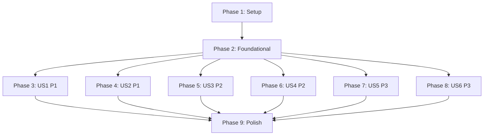

---

description: "Task list for Profile Conversation Conformance"
---

# Tasks: Profile Conversation Conformance

**Input**: Design documents from `/specs/152-profile-conversation-conformance/`

**Prerequisites**: [plan.md](plan.md), [spec.md](spec.md), [research.md](research.md), [data-model.md](data-model.md), [contracts/](contracts/), [quickstart.md](quickstart.md)

**Tests**: Test tasks are **mandatory** here, not optional. D3.3 requires a behavioral change to add or amend a test, and D3.6 requires each test observed failing before the implementation that makes it pass. Every implementation task below is preceded by the assertion task that must be red first.

**Organization**: Tasks are grouped by user story. Note the honest constraint: this feature edits two files heavily (`experience-standard.md` and `highway-profile/SKILL.md`), so genuine parallelism is **low**. `[P]` appears only where files truly differ.

## Format: `[ID] [P?] [Story] Description`

- **[P]**: Can run in parallel (different files, no dependencies)
- **[Story]**: Which user story this task belongs to
- Exact file paths are given in every task

## Path Conventions

Governance and skill authoring repository. No `src/` or `tests/` at root. Paths are:

- Standard: `.highway/governance/experience-standard.md`
- Skills: `.highway/skills/<id>/SKILL.md`
- Tests: `.highway/tools/tests/`
- Generated adapters: `.github/skills/`, `.claude/skills/`, `.cursor/skills/`, `.agents/skills/`

⚠️ Invoke every test with `bash <file>`, never `./<file>` — about thirty test files are not executable and `./` returns rc=126, which reads as a fast pass.

---

## Phase 1: Setup

- [X] T001 Run `bash .highway/tools/tests/run-all.sh` and record the baseline pass count; it must pass before any edit (D3.1)
- [X] T002 Create `.highway/tools/tests/feature-152-profile-conversation-conformance.test.sh` with the header declarations `# Instrument class: static-document-contract` and `# Artifact classes: source-document, generated-artifact`, sourcing `.highway/tools/tests/test-helpers.sh`
- [X] T003 Implement the `--probe <class>` / `--neutralise` contract in `.highway/tools/tests/feature-152-profile-conversation-conformance.test.sh`, following the pattern at `.highway/tools/tests/generate-agent-adapters.test.sh` lines 9–52, with `DECLARED_CLASSES=" source-document generated-artifact "` and exit 2 on an undeclared class (D3.7)
- [X] T004 Verify the probe contract: `--probe source-document` and `--probe generated-artifact` each exit non-zero, each `--neutralise` run exits 0, and an undeclared class exits 2

---

## Phase 2: Foundational

**Blocks every user story.** The rule rows and the shared literal block are global: the rule-count assertion is a single number asserted at five sites, so rows cannot be added story by story without breaking and re-fixing that count repeatedly.

### Tests first (D3.6)

- [X] T005 Add `require_text` assertions for all ten new rule rows X2.58–X2.67 to `.highway/tools/tests/feature-152-profile-conversation-conformance.test.sh`, using the exact row text from [contracts/rule-inventory.md](contracts/rule-inventory.md)
- [X] T006 Add `require_flowed` assertions for the two amended Observables (X2.51 identity test, X2.4 consequential-ambiguity clause) to `.highway/tools/tests/feature-152-profile-conversation-conformance.test.sh`
- [X] T007 Add the rule-total assertion expecting **59** via `grep -cE '^\| X[0-9]+\.[0-9]+ \|'` to `.highway/tools/tests/feature-152-profile-conversation-conformance.test.sh`
- [X] T008 Run `bash .highway/tools/tests/feature-152-profile-conversation-conformance.test.sh` and **observe it fail**, naming the missing rows

### Standard amendment

- [X] T009 Add rows X2.58 through X2.67 to `### X2 - Interaction` in `.highway/governance/experience-standard.md`, verbatim from [contracts/rule-inventory.md](contracts/rule-inventory.md)
- [X] T010 Amend the X2.51 Observable in `.highway/governance/experience-standard.md` to state that comparison with confirmed content ignores whitespace differences; leave the rule text unchanged
- [X] T011 Amend the X2.4 Observable in `.highway/governance/experience-standard.md` to state that material ambiguity in the person's own contribution is consequential, result-changing uncertainty; leave the rule text unchanged (Research D6)
- [X] T012 Bump the version string `10.0.0` → `11.0.0` at line 3 and in the provenance footer of `.highway/governance/experience-standard.md`, and update `Last Amended` to `2026-10-08`
- [X] T013 Rewrite the provenance paragraph in `.highway/governance/experience-standard.md` to name the ten added identifiers, the two amended Observables, and that no identifier is retired by this amendment (D5.3)

### Counter propagation

- [X] T014 Update the rule-count assertion from `49` to `59` in `.highway/tools/tests/experience-standard-amendment.test.sh` line 29
- [X] T015 [P] Update the rule-count assertion from `49` to `59` in `.highway/tools/tests/experience-standard-convergence.test.sh` line 27
- [X] T016 [P] Update the rule-count assertion from `49` to `59` in `.highway/tools/tests/feature-141-experience-standard-refactor.test.sh` line 46
- [X] T017 [P] Update the rule-count assertion from `49` to `59` in `.highway/tools/tests/feature-150-collaborative-convergence.test.sh` line 150
- [X] T018 [P] Update the rule-count assertion from `49` to `59` in `.highway/tools/tests/highway-ux-alignment.test.sh` line 48
- [X] T019 Update the standard version string `10.0.0` → `11.0.0` in `.highway/tools/tests/experience-standard-amendment.test.sh` lines 13–14 and `.highway/tools/tests/feature-141-experience-standard-refactor.test.sh` line 41

### Shared literal block

- [X] T020 Add the shared literal definition block under `#### Domain completeness` in `.highway/skills/highway-profile/SKILL.md`, defining the capture heading, the validation question `**What would you add, correct, or remove?**`, and the acceptance request exactly once, per [contracts/profile-wording.md](contracts/profile-wording.md) and FR-014
- [X] T021 Run `bash .highway/tools/tests/feature-152-profile-conversation-conformance.test.sh` and confirm the rule-row and count assertions now pass

**Checkpoint**: The standard is fully amended. All user stories can now proceed.

---

## Phase 3: User Story 1 — A domain is accepted explicitly, and not re-asked (P1)

**Goal**: An acceptance boundary is required before retention, recognized by meaning rather than phrase, and confirmed substance is never re-presented without naming what changed.

**Independent test**: Confirm the acceptance obligation appears in all four domain instructions and that removing it from any one of them fails this feature's test by name.

- [X] T022 [US1] Add assertions to `.highway/tools/tests/feature-152-profile-conversation-conformance.test.sh` for the acceptance-request literal at each of the four domain sites in `.highway/skills/highway-profile/SKILL.md`, **including a site-count assertion equal to 4** (Research D8)
- [X] T023 [US1] Add assertions for the US1 gate bullets (acceptance boundary, re-presentation ceiling, ambiguity tie-break) in the `## Verification` section of `.highway/skills/highway-profile/SKILL.md`
- [X] T024 [US1] Run the feature test and **observe it fail** on the US1 assertions
- [X] T025 [US1] Reference the shared acceptance request from each of the four domain subsections (`##### Identity`, `##### Vision`, `##### Competitive Path`, `##### Guiding Principles`) in `.highway/skills/highway-profile/SKILL.md`
- [X] T026 [US1] Add the three US1 gate bullets to `## Verification` in `.highway/skills/highway-profile/SKILL.md`
- [X] T027 [US1] Run the feature test and confirm US1 assertions pass
- [X] T028 [US1] Verify SC-004 manually: delete the acceptance request from exactly one domain, confirm the test fails by name, then restore the file

---

## Phase 4: User Story 2 — Every capture looks the same (P1)

**Goal**: All four domains present their candidate under the same capture heading, with the same emphasized validation question, and every superseded string is gone from the repository.

**Independent test**: Confirm the capture heading and single validation question appear at all four domain sites, and that removing either from one domain fails this feature's test by name.

- [X] T029 [US2] Add assertions for the capture heading `**Here's what I've captured as your [domain]:**` at each of the four domain sites in `.highway/skills/highway-profile/SKILL.md`, **including a site-count assertion equal to 4**
- [X] T030 [US2] Add assertions that the validation question is defined exactly once and referenced from four sites in `.highway/skills/highway-profile/SKILL.md` (FR-014)
- [X] T031 [US2] Add `require_absent` assertions for the six superseded strings listed in [contracts/profile-wording.md](contracts/profile-wording.md) — the four old validation questions and their trailing sentences (FR-030)
- [X] T032 [US2] Add assertions for the US2 gate bullets (capture heading, single validation question, emphasis) in `## Verification` of `.highway/skills/highway-profile/SKILL.md`
- [X] T033 [US2] Run the feature test and **observe it fail** on the US2 assertions
- [X] T034 [US2] Reference the shared capture heading from all four domain subsections in `.highway/skills/highway-profile/SKILL.md`
- [X] T035 [US2] Replace the four per-domain validation questions with a reference to the single defined question in `.highway/skills/highway-profile/SKILL.md`, removing the superseded strings and their trailing sentences outright
- [X] T036 [US2] Rewrite the existing `## Verification` bullet `- Each domain's validation question asks what is missing or wrong in the candidate.` to `- Each domain uses the single defined validation question.` in `.highway/skills/highway-profile/SKILL.md` (FR-013)
- [X] T037 [US2] Add the capture-heading and emphasis gate bullets to `## Verification` in `.highway/skills/highway-profile/SKILL.md`
- [X] T038 [US2] Run the feature test and confirm US2 assertions pass
- [X] T039 [US2] Verify SC-004 manually: delete the capture heading from exactly one domain, confirm the test fails by name, then restore the file

---

## Phase 5: User Story 3 — A correction is honored as given (P2)

**Goal**: A rejected term does not reappear including as a synonym, an amendment preserves the accepted content's form, and a correction that cannot be located is reported rather than misapplied or dropped.

**Independent test**: Confirm the correction-handling gates are present and that removing any one fails this feature's test by name.

- [X] T040 [US3] Add assertions for the US3 gate bullets (rejected vocabulary, amendment form, unlocatable correction) in `## Verification` of `.highway/skills/highway-profile/SKILL.md`
- [X] T041 [US3] Run the feature test and **observe it fail** on the US3 assertions
- [X] T042 [US3] Add the three US3 gate bullets to `## Verification` in `.highway/skills/highway-profile/SKILL.md`
- [X] T043 [US3] Run the feature test and confirm US3 assertions pass

**Note**: X2.62, X2.63, and X2.64 are **rule-only** under Research D1 — not reducible to an emitted literal or a skill-owned procedure. This story's leg is therefore weaker than US1's or US2's, and the completion report must say so rather than counting it as equally enforced.

---

## Phase 6: User Story 4 — The conversation adds something (P2)

**Goal**: Each Substantive Contribution receives one acknowledgment that adds understanding beyond restating it, and ambiguity in the person's own contribution is treated as worth asking about.

**Independent test**: Confirm the acknowledgment gates are present and that removing either fails this feature's test by name.

- [X] T044 [US4] Add assertions for the US4 gate bullets (acknowledgment substance, acknowledgment occurrence) in `## Verification` of `.highway/skills/highway-profile/SKILL.md`
- [X] T045 [US4] Run the feature test and **observe it fail** on the US4 assertions
- [X] T046 [US4] Add the two US4 gate bullets to `## Verification` in `.highway/skills/highway-profile/SKILL.md`
- [X] T047 [US4] Run the feature test and confirm US4 assertions pass
- [X] T048 [US4] Confirm the X2.4 Observable amendment from T011 reads as a clarification of X2.4's existing meaning rather than a carve-out, so that exactly one rule governs the composition moment (Research D6)

---

## Phase 7: User Story 5 — Nothing leaks from behind the curtain (P3)

**Goal**: Internal vocabulary does not surface, readiness states how completeness is obtained, and persistence names its operation — with authorization scoped locally.

**Independent test**: Confirm `## Readiness` names the artifact it reads and `## Operations` names the write, and that removing either fails this feature's test by name.

- [X] T049 [US5] Add `require_flowed` assertions for the readiness-acquisition sentence and the persistence-operation sentence in `.highway/skills/highway-profile/SKILL.md`
- [X] T050 [US5] Add assertions for the US5 gate bullets (internal vocabulary, readiness acquisition, persistence operation) in `## Verification` of `.highway/skills/highway-profile/SKILL.md`
- [X] T051 [US5] Add a `require_absent` assertion confirming no general permission and no general prohibition about command surfaces was added to `.highway/governance/experience-standard.md` (FR-026)
- [X] T052 [US5] Run the feature test and **observe it fail** on the US5 assertions
- [X] T053 [US5] Add to `## Readiness` in `.highway/skills/highway-profile/SKILL.md` that domain completeness is obtained by reading the retained Profile record at its declared path, naming that path explicitly (FR-024, P1.5)
- [X] T054 [US5] Add to `## Operations` in `.highway/skills/highway-profile/SKILL.md` that the authorized mutation is a write to the retained Profile record (FR-025)
- [X] T055 [US5] Add to `## Readiness` in `.highway/skills/highway-profile/SKILL.md` the Profile-owned internal vocabulary that must not surface in orchestrated conversation, extending the existing machine-fields sentence
- [X] T056 [US5] Add the three US5 gate bullets to `## Verification` in `.highway/skills/highway-profile/SKILL.md`
- [X] T057 [US5] Run the feature test and confirm US5 assertions pass

---

## Phase 8: User Story 6 — Where you're going and how you'll get there stay distinct (P3)

**Goal**: Vision carries a negative boundary in the same form Competitive Path already has, and cross-domain preservation appears at the point of composition rather than only as a gate.

**Independent test**: Confirm the Vision boundary clause and the cross-domain instruction are present in the domain instructions, and that removing either fails this feature's test by name.

- [X] T058 [US6] Add a `require_flowed` assertion for the Vision negative boundary clause in `.highway/skills/highway-profile/SKILL.md`
- [X] T059 [US6] Add a `require_flowed` assertion for the cross-domain preservation instruction at the point of composition in `.highway/skills/highway-profile/SKILL.md`, separate from the existing `## Verification` bullet
- [X] T060 [US6] Run the feature test and **observe it fail** on the US6 assertions
- [X] T061 [US6] Add a negative boundary clause to the `##### Vision` meaning paragraph in `.highway/skills/highway-profile/SKILL.md`, in the same form as the existing Competitive Path clause, stating that Vision does not elicit or retain approach, sequencing, or organizational method (FR-027)
- [X] T062 [US6] Add the cross-domain preservation instruction to the domain instructions in `.highway/skills/highway-profile/SKILL.md`, keeping the existing `## Verification` bullet `- Supported cross-domain implications are preserved for the appropriate unresolved domain.` in place (FR-028)
- [X] T063 [US6] Run the feature test and confirm US6 assertions pass

---

## Phase 9: Polish & Cross-Cutting Concerns

### Version and counter propagation

- [X] T064 Bump `version: 10.0.0` → `version: 11.0.0` in `.highway/skills/highway-profile/SKILL.md`
- [X] T065 Update the Profile version string at all eight test sites: `.highway/tools/tests/feature-092-contract.test.sh` line 80, `feature-136-profile-substantive-re-evaluation.test.sh` line 15, `feature-137-profile-acquisition-expression-persistence.test.sh` line 42, `feature-138-visible-profile-structure.test.sh` line 52, `feature-140-profile-convergence-alignment.test.sh` line 22, `profile-behavior.test.sh` line 41, `profile-runtime-separation.test.sh` line 30, `profile-structure.test.sh` line 49

### Constitution compliance

- [X] T066 Measure the word count of every touched normative section in `.highway/skills/highway-profile/SKILL.md` — `#### Domain completeness`, the four domain subsections, `## Readiness`, `## Operations` — and confirm each is 400 or fewer (P7.5, the plan's tracked risk)
- [X] T067 If any section exceeds 400 words, tighten the shared-reference wording per Research D2; do **not** split a section, which would break assertions in eight other tests
- [X] T068 Confirm no skill other than `.highway/skills/highway-profile/SKILL.md` was modified: `git diff --name-only -- .highway/skills/` names only the Profile skill

### Regeneration

- [X] T069 Run the four repo-state generators from repo root: `.highway/tools/generate-agent-adapters.sh`, `generate-catalog.sh`, `generate-instructions.sh`, `generate-library-catalog.sh` (D4.4, D4.7). `generate-distribution.sh` is excluded: it is an export tool requiring a `<target-directory>` argument and does not regenerate in-repo state.
- [X] T070 Confirm `.highway/skills/highway-profile/SKILL.md` is byte-identical to its four adapters using `cmp -s` against `.github/skills/`, `.claude/skills/`, `.cursor/skills/`, `.agents/skills/`
- [X] T071 Add the adapter byte-identity assertions to `.highway/tools/tests/feature-152-profile-conversation-conformance.test.sh`, satisfying the declared `generated-artifact` class

### Final verification

- [X] T072 Confirm no stale counters remain: `grep -rn 'ne 49' .highway/tools/tests/` and `grep -rn '10\.0\.0' .highway/tools/tests/` both return no output
- [X] T073 Re-run the full probe contract from T004 against the finished test file, confirming both declared classes still fail when seeded (D3.7)
- [X] T074 Run `bash .highway/tools/tests/run-all.sh` and confirm it passes with a count greater than the T001 baseline (D3.2)
- [X] T075 Confirm `.highway/tools/README.md` and the generated catalog reflect the new test file and the changed Profile version (D6.1, D6.2)
- [X] T076 Re-evaluate the Constitution Check in [plan.md](plan.md) against the finished change and record any verdict that moved

---

## Dependencies



**Hard dependencies**:

- T020 (shared literal block) blocks T025 and T034 — both reference it
- T009–T013 (rule rows) block T014–T019 (counters), which assert the resulting total
- All skill edits block T069 (regeneration), since SKILL.md is a generator input
- T064 (Profile version bump) must land before T065 (test sites), or the suite fails between the two

**Story independence**: US3 through US6 touch disjoint regions of `highway-profile/SKILL.md` and could in principle interleave, but they all append to the same `## Verification` list. Treat that list as a serialization point.

---

## Parallel Execution Opportunities

Genuine parallelism is limited. These are the real ones:

**Phase 2 counter updates** — five different test files, no shared state:

```text
T015  .highway/tools/tests/experience-standard-convergence.test.sh
T016  .highway/tools/tests/feature-141-experience-standard-refactor.test.sh
T017  .highway/tools/tests/feature-150-collaborative-convergence.test.sh
T018  .highway/tools/tests/highway-ux-alignment.test.sh
```

Everything else serializes on `experience-standard.md` or `highway-profile/SKILL.md`. Those are the
only two source files this feature modifies, apart from tests and generated adapters.

---

## Implementation Strategy

**MVP scope**: Phase 1 + Phase 2 + Phase 3 (US1) + Phase 4 (US2).

That pairing is deliberate. US1 and US2 are the two P1 stories, and they are also the two whose delivery is strongest — both land as emitted literals with per-site count assertions, which is the only mechanism Research D1 found evidence for. US2 in particular closes the gap that produced the clearest observed defect: `highway-profile` is the only skill in the repository missing the capture heading, and the only one observed violating X2.21.

**Incremental delivery**:

1. Phases 1–2 — the standard is amended and the suite is consistent. Shippable on its own.
2. Phases 3–4 — the two P1 stories. This is the MVP.
3. Phases 5–6 — P2 stories. Both are rule-only or gate-only; weaker legs, honestly labeled.
4. Phases 7–8 — P3 stories. US5 is procedure-backed and stronger than its priority suggests.
5. Phase 9 — regeneration and compliance. Not optional; D4.7 makes it part of the change.

**Two things to keep visible while executing**:

- Every check in this feature is a static document contract. None of it is evidence that any of the thirteen behaviors occurs in a real conversation. D3.8 forbids recording it as such, and D7.3 requires the completion report to state requirement coverage separately from check results.
- `highway-profile` is the **only** skill this feature touches. T068 asserts that mechanically. Conformance work on any other skill belongs to a separate spec.
